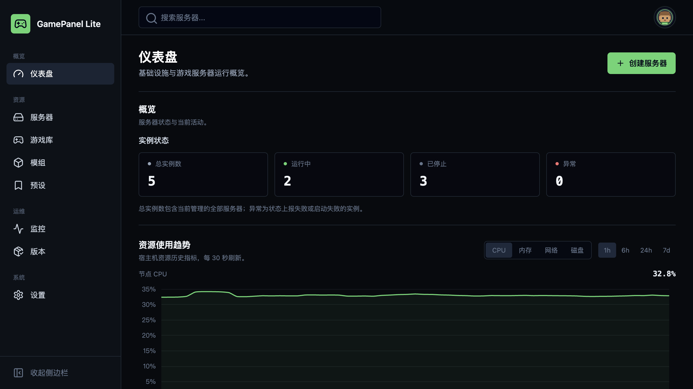
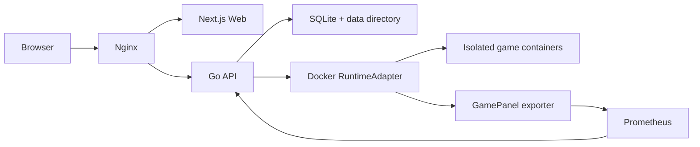

<h1 align="center">GamePanel Lite</h1>

<p align="center">
  A lightweight, self-hosted control panel for running game servers with Docker.
</p>

<p align="center">
  <a href="https://dev.gamepanel.site">Live demo</a> ·
  <a href="#quick-start">Quick start</a> ·
  <a href="docs/README.zh-CN.md">简体中文</a> ·
  <a href="https://github.com/smartcat999/game-panel-lite/releases">Releases</a>
</p>

<p align="center">
  <a href="https://github.com/smartcat999/game-panel-lite/releases"></a>
  <a href="LICENSE"></a>
  
  
  
</p>



GamePanel Lite gives players and small server operators one place to create instances, inspect health, manage configuration and mods, view logs, and protect world data. Each game server runs in an isolated container with its own data directory. The panel stays self-hosted and does not require a cloud account or hosted control plane.

## Capabilities

| Area | What is included |
| --- | --- |
| Instances | Create, start, stop, restart, filter, and manage multiple isolated servers |
| Configuration | Provider-aware fields, reusable presets, resource limits, and port allocation |
| Operations | Live status, logs, console access, player information, and join details |
| Data | World import, backup, restore, migration, and isolated instance directories |
| Mods | Workshop discovery, mod library, mod packs, server assignment, and tModLoader ModConfig files |
| Monitoring | Host and container metrics backed by Prometheus, cAdvisor, and node-exporter |
| Updates | Runtime-image management, SteamCMD game-file updates, and asynchronous panel updates |

### Included game providers

| Game | Runtime mode |
| --- | --- |
| Terraria | Vanilla, tModLoader |
| Don't Starve Together | Master and optional Caves shards |
| Palworld | Dedicated server |
| Minecraft | Java Edition |

Provider capabilities differ by game. The interface only exposes configuration, world, mod, and update operations supported by the selected provider.

## Quick Start

### Requirements

- Linux host with Docker Engine and the Docker Compose plugin
- `curl` and `tar`
- An `amd64` host for the published control-plane images
- Writable installation directory and enough disk space for game files, worlds, backups, and mods

Install the current stable release:

```bash
# Installs to ~/gamepanel-lite
curl -fsSL https://raw.githubusercontent.com/smartcat999/game-panel-lite/main/scripts/install-online.sh | sh

# Or choose an installation directory
curl -fsSL https://raw.githubusercontent.com/smartcat999/game-panel-lite/main/scripts/install-online.sh | sh -s -- "$HOME/apps/gamepanel-lite"
```

Open `http://YOUR_SERVER_IP:3001` after the containers start.

### Enable HTTPS

Point a domain at the host, then run:

```bash
cd ~/gamepanel-lite
sudo sh scripts/setup-https.sh panel.example.com admin@example.com
```

HTTPS uses `compose.prod.yaml` together with `compose.https.yaml`. The override replaces the same Nginx service, so one reverse proxy owns the public ports. On systemd hosts, setup also installs a daily certificate-renewal check.

## Operations

Run control-plane operations from the installation directory:

```bash
sudo sh scripts/manage.sh status
sudo sh scripts/manage.sh start
sudo sh scripts/manage.sh update
sudo sh scripts/manage.sh stop
```

`manage.sh update` pulls and recreates changed panel services. It does not recreate game containers or modify saves. The Settings page offers the same panel-update workflow when the updater service is available.

Useful checks:

```bash
docker compose -f compose.prod.yaml ps
curl http://127.0.0.1:3001/healthz
sudo journalctl -u gamepanel-lite-https-renewal.service
```

### Update boundaries

GamePanel Lite separates three kinds of updates:

1. **Panel release:** API, Web, exporter, updater, and deployment files.
2. **Runtime image:** the provider image used when an instance is created or its image is changed.
3. **Game files:** files inside an existing server data directory, updated by SteamCMD where supported.

Updating the panel does not stop game servers. Updating a runtime image does not silently replace an existing server's game files. Server-level game-file updates remain available even when a newer runtime image has not been published yet.

## Architecture



The API keeps provider-specific behavior outside the Docker runtime adapter. One server instance maps to one container and one isolated data directory.

## Data and Backups

Persistent state is stored under `data/` in the installation directory:

- SQLite database and panel settings
- Per-instance game files and saves
- Imported worlds and generated configuration
- Backups, mods, and mod configuration
- Prometheus time-series data

Back up the entire `data/` directory before moving the installation or performing host-level maintenance. Do not expose arbitrary host paths to game containers.

## Development

The backend is Go with chi, SQLite, and the Docker SDK. The frontend is Next.js, React, TypeScript, Tailwind CSS, and TanStack Query.

```bash
pnpm install

# Run the API and Web development servers
pnpm dev:api
pnpm dev:web

# Required checks
go test ./...
go vet ./...
pnpm lint
pnpm typecheck
pnpm build
```

Production panel images are built with the configured buildx builder (`my-builder` by default) for `linux/amd64`:

```bash
scripts/build-panel-images.sh --version v0.2.3 --push
```

Runtime dependencies are mirrored into both GamePanel Lite registries so regional deployments never need to mix upstream registries:

```bash
# Requires authentication for Docker Hub and Alibaba Cloud Container Registry.
scripts/mirror-control-plane-images.sh --push
```

The mirror job is pinned to `linux/amd64` and publishes Nginx, Certbot, Prometheus, cAdvisor, and Node Exporter under the same registry namespace used by the panel images.

## Project Status

GamePanel Lite is under active development and intended for early self-hosted use. Review the [release notes](https://github.com/smartcat999/game-panel-lite/releases) before updating, and keep an external copy of important worlds and backups.

Bug reports and focused feature requests are welcome in [GitHub Issues](https://github.com/smartcat999/game-panel-lite/issues).

## License

GamePanel Lite is released under the [Apache License 2.0](LICENSE).
