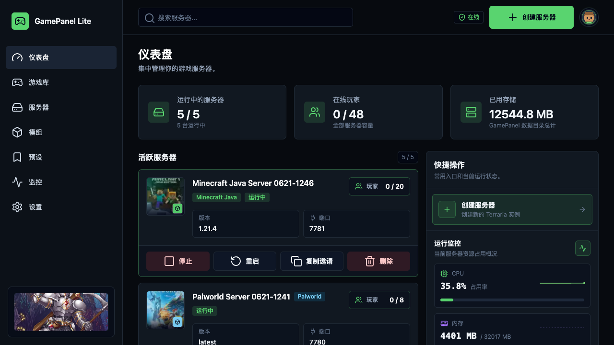

# GamePanel Lite

GamePanel Lite 是一个轻量、现代、可自托管的游戏服务器管理面板，适合个人玩家、朋友小队、社区服主和私服管理员使用。你可以通过网页创建服务器、启动和停止实例、查看日志、管理世界、备份数据，并发现和安装模组。

[官网/体验地址](https://dev.gamepanel.site) · [English README](../README.md)



## 为什么选择 GamePanel Lite

开游戏服务器不应该依赖一堆命令、散落的配置文件和手动整理目录。GamePanel Lite 把常用的服务器管理流程整理到一个清晰的网页里，让开服和维护更简单。

- 自托管：部署在你自己的机器或服务器上。
- 面向玩家：围绕服务器、世界、备份、日志、连接信息和模组设计。
- 轻量运行：不绑定云厂商，不需要复杂账号体系。
- 多实例管理：每个服务器都有独立的数据目录。
- 持续扩展：从 Terraria 体验起步，逐步扩展更多游戏和模组生态。

## 核心功能

- 创建和管理多个游戏服务器
- 启动、停止、重启服务器实例
- 查看服务器状态、日志和控制台
- 导入、备份、恢复和管理世界文件
- 发现推荐模组并加入服务器
- 集中管理服务器文件、世界、备份和模组

## 快速开始

准备一台已经安装 Docker 的服务器，然后运行：

```bash
curl -fsSL https://raw.githubusercontent.com/smartcat999/game-panel-lite/main/scripts/install-online.sh | sh

# 或指定自定义安装路径：
curl -fsSL https://raw.githubusercontent.com/smartcat999/game-panel-lite/main/scripts/install-online.sh | sh -s -- /opt/gamepanel-lite
```

启动完成后访问：

```text
http://服务器IP:3001
```

如果你已经把域名解析到服务器，可以开启 HTTPS：

```bash
cd ~/gamepanel-lite && sudo sh scripts/setup-https.sh your-domain.com your-email@example.com
```

在使用 systemd 的主机上，HTTPS 初始化会安装持久化的每日证书续期检查。Certbot 只有在证书进入续期窗口后才会真正替换证书，因此每天检查是安全的。已有 HTTPS 部署可以执行：

```bash
cd ~/gamepanel-lite
sudo sh scripts/install-https-renewal-timer.sh
sudo systemctl status gamepanel-lite-https-renewal.timer
```

立即执行一次续期检查或查看日志：

```bash
sudo systemctl start gamepanel-lite-https-renewal.service
sudo journalctl -u gamepanel-lite-https-renewal.service
```

Certbot Compose 服务已放入 `certificate` profile，普通控制平面启动不会再创建一个退出状态的 Certbot 容器。

## 远程服务器维护

生产环境只使用 `compose.prod.yaml`。启用 HTTPS 后，`compose.https.yaml` 会替换同一个 `nginx` 服务的端口和配置，不会再创建第二个 Nginx。

在远程服务器更新控制平面镜像并重建有变化的服务：

```bash
cd ~/gamepanel-lite
sudo sh scripts/manage.sh update
```

启动、停止和查看状态：

```bash
sudo sh scripts/manage.sh start
sudo sh scripts/manage.sh stop
sudo sh scripts/manage.sh status
```

`manage.sh` 会自动检测当前是 HTTP 还是 HTTPS 部署。它只管理面板、API、Nginx 和监控服务；帕鲁、饥荒等游戏容器仍由 GamePanel Lite 管理，不会在更新控制平面时被重建。

不要在生产服务器叠加使用 `compose.yaml`。该文件用于本地开发，可能额外暴露 Web 端口。

## 数据保存

GamePanel Lite 默认把数据保存在安装目录下的 `data/`，包括本地数据库、服务器实例、世界、备份和模组文件。

## 当前状态

GamePanel Lite 正在积极开发中，适合早期自托管试用。当前重点完善 Terraria / tModLoader 服务器管理，同时继续推进 Don't Starve Together 和 Palworld 的模组管理流程。
