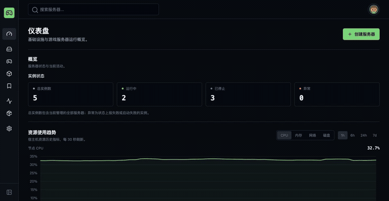

<h1 align="center">🎮 GamePanel Lite</h1>

<p align="center">
  <strong>新一代轻量级自托管分布式游戏服务器管理面板。</strong><br>
  在一处轻松部署与管理泰拉瑞亚、饥荒联机版、幻兽帕鲁和我的世界服务器，支持多计算节点集群调度。
</p>

<p align="center">
  <a href="https://dev.gamepanel.site">🌐 在线体验 Demo</a> ·
  <a href="#-极速安装">⚡ 极速安装</a> ·
  <a href="USER_GUIDE.zh-CN.md">📖 图文使用指南</a> ·
  <a href="../README.md">🇺🇸 English</a> ·
  <a href="https://github.com/smartcat999/game-panel-lite/releases">📦 版本发布</a>
</p>

<p align="center">
  <a href="https://github.com/smartcat999/game-panel-lite/releases"></a>
  <a href="../LICENSE"></a>
  
  
  
</p>

<p align="center">
  
</p>

---

## ✨ 核心亮点

- **🎮 多游戏引擎深度原生适配**：深度管理 **泰拉瑞亚**（原版 / tModLoader）、**饥荒联机版**（地面+洞穴多世界分片集群）、**幻兽帕鲁** 及 **我的世界 Java 版**。
- **🌐 分布式多节点与集群舰队**：支持跨多台物理机/云服务器调度游戏容器，主控面板集成实时网络与流量拓扑透视。
- **📦 一体化创意工坊与模组中心**：直接在 Web 界面检索 Steam Workshop 模组、配置依赖、并进行可视化一键启用/禁用。
- **⏱️ 时光机快照与秒级存档回档**：一键保存当前世界快照，支持备份即时下载与灾难秒级回档还原。
- **📊 工业级可观测性监控大盘**：原生集成 Prometheus，实时监控主机与容器级 CPU、内存、网络 I/O 及集群事件流。
- **💻 交互式 Web 控制台与日志流**：低延迟 SSE 实时日志推流，内置快捷控制台命令与开黑大厅邀请机制。
- **🛡️ 纯 Docker 容器隔离与安全**：每个游戏服务器均运行在独立的 Docker 沙箱内，拥有严格的资源限制与持久化卷隔离。

---

## 🎮 游戏支持矩阵

| 游戏 | 运行引擎 / 模式 | 模组支持 | 世界时光机快照 | 可视化游戏规则配置 |
| :--- | :--- | :--- | :--- | :--- |
| **泰拉瑞亚 (Terraria)** | 原版 / tModLoader | ✅ Steam 创意工坊 & .tmod | ✅ 时光机快照回档 | ✅ 可视化世界与游戏规则 |
| **饥荒联机版 (DST)** | 多分片集群 (地面 + 洞穴) | ✅ Workshop 模组与自动配置 | ✅ 完整集群存档备份 | ✅ 世界倍率与分片配置 |
| **幻兽帕鲁 (Palworld)** | 虚幻引擎 5 专用服 | ✅ 配置文件与存档管理 | ✅ 世界时光机快照 | ✅ 帕鲁捕捉与经验倍率 |
| **我的世界 (Minecraft)** | Paper / Fabric / 原版 | ✅ 插件与数据包管理 | ✅ 世界完整备份 | ✅ server.properties 编辑器 |

---

## ⚡ 极速安装

### 一键自动化安装脚本

需满足系统环境：Linux (`amd64`)、Docker Engine 24+ 及 Docker Compose v2+。

```bash
curl -fsSL https://raw.githubusercontent.com/smartcat999/game-panel-lite/main/scripts/install-online.sh | sh
```

安装完成后，在浏览器中打开 `http://你的服务器IP:3001` 即可访问。

---

## 🏗️ 系统架构设计

```
[ Web 控制台 (Next.js 15 + Tailwind) ] 
                 │ (REST API / SSE 实时推流)
[ 主控调度端 (Golang Chi + SQLite) ] ── [ Prometheus 可观测性系统 ]
                 │ 
   ┌─────────────┴─────────────────────────────┐ (WebSocket 安全反向流隧道)
   ▼                                           ▼
[ 本地宿主机 Daemon ]                 [ 边缘 Worker Agent 节点 ]
   ├── 泰拉瑞亚 容器 (Docker)            ├── 幻兽帕鲁 容器 (Docker)
   └── 饥荒联机版 分片容器 (Docker)       └── 我的世界 容器 (Docker)
```

---

## 📖 文档导航

- [完整图文用户指南 (中文)](USER_GUIDE.zh-CN.md)
- [User Guide (English)](USER_GUIDE.md)
- [系统架构与开发演进规划](goals/V1_PLAN.md)

---

## 🤝 社区交流与问题反馈

- [提交 Bug 缺陷](https://github.com/smartcat999/game-panel-lite/issues/new?template=bug_report.yml)
- [提出新功能建议](https://github.com/smartcat999/game-panel-lite/issues/new?template=feature_request.yml)
- [参与社区 Issue 讨论](https://github.com/smartcat999/game-panel-lite/issues)

---

## 📄 开源许可证

本项目基于 [Apache License 2.0](../LICENSE) 协议开源。
