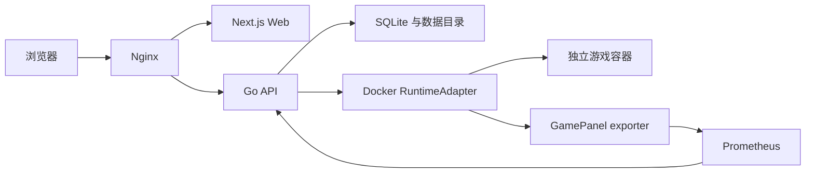

<h1 align="center">GamePanel Lite</h1>

<p align="center">
  基于 Docker 的轻量级自托管游戏服务器管理面板。
</p>

<p align="center">
  <a href="https://dev.gamepanel.site">在线体验</a> ·
  <a href="#快速开始">快速开始</a> ·
  <a href="../README.md">English</a> ·
  <a href="https://github.com/smartcat999/game-panel-lite/releases">版本说明</a>
</p>

<p align="center">
  <a href="https://github.com/smartcat999/game-panel-lite/releases"></a>
  <a href="../LICENSE"></a>
  
  
  
</p>


GamePanel Lite 为个人玩家、朋友小队和小型社区服主提供统一的服务器管理入口。每个游戏服务器使用独立容器和数据目录运行，可以在网页中创建实例、查看状态、管理配置与模组、读取日志并保护世界数据。面板完全自托管，不依赖云厂商账号或托管控制平面。

## 能力范围

| 领域 | 已支持能力 |
| --- | --- |
| 实例 | 创建、启动、停止、重启、筛选和批量管理多个独立服务器 |
| 配置 | 游戏专属参数、配置预设、资源限制和端口分配 |
| 运维 | 实时状态、日志、控制台、玩家信息和加入方式 |
| 数据 | 世界导入、备份、恢复、迁移和独立实例目录 |
| 模组 | 创意工坊发现、模组库、模组包、服务器安装和 tModLoader ModConfig |
| 监控 | 基于 Prometheus、cAdvisor 和 node-exporter 的主机与容器指标 |
| 更新 | 运行镜像管理、SteamCMD 游戏文件更新和异步面板更新 |

### 已包含的游戏提供器

| 游戏 | 运行模式 |
| --- | --- |
| Terraria | 原版、tModLoader |
| 饥荒联机版 | 地面分片和可选洞穴分片 |
| 幻兽帕鲁 | 专用服务器 |
| 我的世界 | Java 版 |

不同游戏提供器的能力范围并不完全相同。界面只会展示当前提供器支持的配置、世界、模组和更新操作。

## 快速开始

### 环境要求

- 安装了 Docker Engine 和 Docker Compose 插件的 Linux 主机
- `curl` 与 `tar`
- 使用官方控制平面镜像时需要 `amd64` 主机
- 可写的安装目录，以及足够保存游戏文件、世界、备份和模组的磁盘空间

安装当前稳定版本：

```bash
# 默认安装到 ~/gamepanel-lite
curl -fsSL https://raw.githubusercontent.com/smartcat999/game-panel-lite/main/scripts/install-online.sh | sh

# 或指定安装目录
curl -fsSL https://raw.githubusercontent.com/smartcat999/game-panel-lite/main/scripts/install-online.sh | sh -s -- "$HOME/apps/gamepanel-lite"
```

容器启动后访问 `http://服务器IP:3001`。

### 启用 HTTPS

先把域名解析到服务器，然后执行：

```bash
cd ~/gamepanel-lite
sudo sh scripts/setup-https.sh panel.example.com admin@example.com
```

HTTPS 部署会组合使用 `compose.prod.yaml` 和 `compose.https.yaml`。覆盖文件替换的是同一个 Nginx 服务，不会创建第二个反向代理。使用 systemd 的主机会同时安装每日证书续期检查。

## 日常运维

在安装目录中执行控制平面操作：

```bash
sudo sh scripts/manage.sh status
sudo sh scripts/manage.sh start
sudo sh scripts/manage.sh update
sudo sh scripts/manage.sh stop
```

`manage.sh update` 只拉取并重建发生变化的面板服务，不会重建游戏容器或修改存档。启用 updater 服务后，也可以在设置页完成同样的异步面板更新流程。

常用检查命令：

```bash
docker compose -f compose.prod.yaml ps
curl http://127.0.0.1:3001/healthz
sudo journalctl -u gamepanel-lite-https-renewal.service
```

### 三种更新的边界

GamePanel Lite 明确区分三类更新：

1. **面板版本：** API、Web、exporter、updater 和部署文件。
2. **运行镜像：** 创建实例或主动切换镜像时使用的游戏提供器镜像。
3. **游戏文件：** 已有服务器数据目录中的文件，在支持时通过 SteamCMD 更新。

更新面板不会停止游戏服务器；更新运行镜像不会静默替换已有服务器的游戏文件；即使新的运行镜像尚未发布，服务器仍然可以使用游戏文件更新功能。

## 系统结构


```mermaid
flowchart LR
    Browser["浏览器"] --> Proxy["Nginx"]
    Proxy --> Web["Next.js Web"]
    Proxy --> API["Go API"]
    API --> DB["SQLite 与数据目录"]
    API --> Docker["Docker RuntimeAdapter"]
    Docker --> Games["独立游戏容器"]
    Exporter["GamePanel exporter"] --> Prometheus["Prometheus"]
    Docker --> Exporter
    Prometheus --> API
```

API 将游戏专属逻辑与 Docker 运行适配器分离。一个服务器实例对应一个容器和一个独立数据目录。

## 数据与备份

持久化数据默认保存在安装目录的 `data/` 下：

- SQLite 数据库与面板设置
- 各实例的游戏文件和存档
- 导入的世界与生成的配置
- 备份、模组和模组配置
- Prometheus 时序数据

迁移安装目录或进行主机级维护前，请备份完整的 `data/` 目录。不要向游戏容器暴露任意主机路径。

## 本地开发

后端使用 Go、chi、SQLite 和 Docker SDK；前端使用 Next.js、React、TypeScript、Tailwind CSS 和 TanStack Query。

```bash
pnpm install

# 分别启动 API 和 Web 开发服务
pnpm dev:api
pnpm dev:web

# 必需检查
go test ./...
go vet ./...
pnpm lint
pnpm typecheck
pnpm build
```

发布面板镜像时使用配置好的 buildx builder（默认为 `my-builder`），并构建 `linux/amd64` 镜像：

```bash
scripts/build-panel-images.sh --version v0.2.1 --push
```

## 项目状态

GamePanel Lite 正在持续开发，适合早期自托管使用。更新前请阅读[版本说明](https://github.com/smartcat999/game-panel-lite/releases)，并为重要世界和备份保留一份外部副本。

欢迎通过 [GitHub Issues](https://github.com/smartcat999/game-panel-lite/issues) 提交可复现的问题和范围明确的功能建议。

## 开源许可证

GamePanel Lite 使用 [Apache License 2.0](../LICENSE)。
