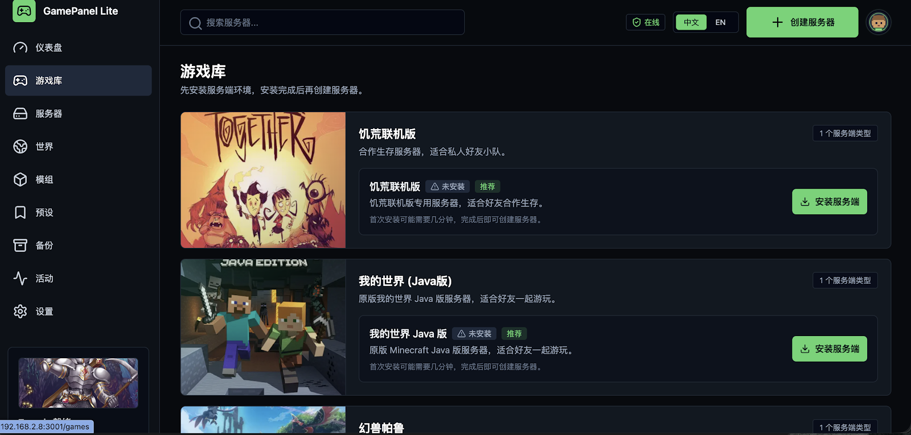
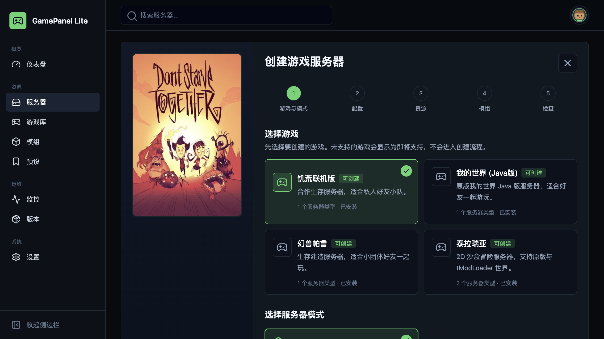
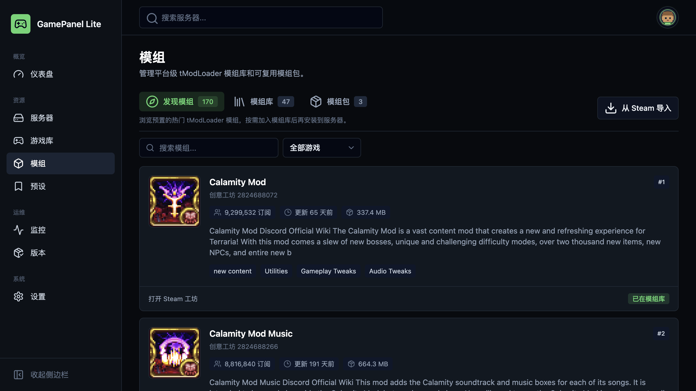

# GamePanel Lite Illustrated User Guide

[Back to README](../README.md) · [简体中文](USER_GUIDE.zh-CN.md)

This guide covers the path from first login to routine maintenance. Screens may evolve between releases, while the navigation and operating model remain consistent.

## Installation

Requirements: Linux `amd64`, Docker Engine, and Docker Compose. Run:

```bash
curl -fsSL https://raw.githubusercontent.com/smartcat999/game-panel-lite/main/scripts/install-online.sh | sh
```

The installer asks for the installation directory and image region. It defaults to the last successful directory, or `~/gamepanel-lite` on first use. For unattended mainland China installation:

```bash
curl -fsSL https://raw.githubusercontent.com/smartcat999/game-panel-lite/main/scripts/install-online.sh \
  | GAMEPANEL_IMAGE_REGION=cn sh
```

## 1. Open the panel

After installation, visit:

```text
http://YOUR_SERVER_IP:3001
```

Create the local administrator on first access. If the page is unreachable, allow TCP `3001` in both the cloud and host firewalls. Use the configured domain after enabling HTTPS.


The dashboard summarizes instance state and host resource trends.

## 2. Install a runtime image

Open **Game Library**, find the required game or mode, and select **Install runtime image**. The matching server can be created after its status becomes **Installed**.



The runtime image supplies the server environment. Each server keeps its save data, configuration, and game files in an isolated data directory.

## 3. Create a server

Select **Create server** in the page header and complete the wizard:

1. Choose the game and runtime mode.
2. Enter the server, world, password, and game settings.
3. Set CPU, memory, and the external port.
4. Select mods or a mod pack when supported.
5. Review the summary and create the server.



Prefer automatic port allocation. When limiting memory, reserve capacity for the operating system, Docker, and the control panel.

## 4. Allow the port and join

The server detail page shows the final public address, port, and password. Check all of the following:

- The cloud security group or firewall.
- UFW, iptables, or another host firewall.
- The TCP or UDP protocol required by the game.

Use the actual port and protocol shown by the server rather than assuming the game's default. Update firewall rules whenever the external port changes.

## 5. Manage servers

The **Servers** page supports start, stop, restart, and bulk actions. Open a server to access its overview, join information, live logs, console, players, configuration, resources, and game-specific tabs.

A running server must be stopped before deletion. Configuration and mod changes show whether a restart or world regeneration is required.

## 6. Install and manage mods

Open **Mods** to discover supported Workshop content, import mods, create reusable mod packs, and install them on a server.



Client and server mod requirements differ. Check the mod classification and make sure players install the matching client version when required.

## 7. HTTPS and panel updates

### HTTPS

1. Point a domain to the server's public IP.
2. Allow TCP `80` and `443`.
3. Open **Settings → Access & HTTPS**.
4. Enter the domain and email, then enable HTTPS.

The installed renewal timer manages certificate renewal. Its status and manual check are available on the same page.

### Update the panel

Open **Settings → Updates & Maintenance** to check and apply a release. Updating briefly restarts the control plane without recreating running game servers or save data.

## 8. Recover from the command line

If the panel is unavailable, connect over SSH and run these commands from the installation directory:

```bash
cd <installation-directory>
sudo sh scripts/manage.sh status
sudo sh scripts/manage.sh update
sudo sh scripts/manage.sh start
sudo sh scripts/manage.sh stop
```

Check control-plane status, container logs, free disk space, memory, listening ports, and firewall rules in that order. Include reproduction steps, screenshots, and sanitized logs in bug reports.

## 9. Get help

- [Report a bug](https://github.com/smartcat999/game-panel-lite/issues/new?template=bug_report.yml)
- [Request a feature](https://github.com/smartcat999/game-panel-lite/issues/new?template=feature_request.yml)
- [Review existing issues](https://github.com/smartcat999/game-panel-lite/issues)
