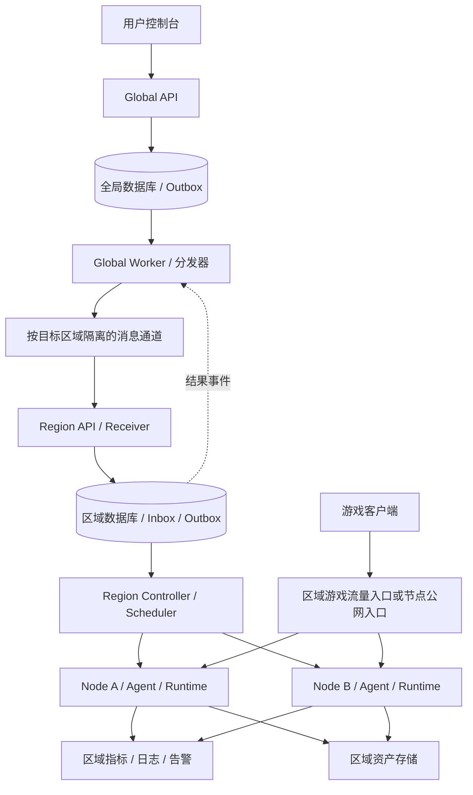

# Global / Region / Node 目标架构与交付契约

日期：2026-09-08。状态：用户已确认架构方向；本文是目标设计，尚非实现或生产验收报告。

本设计采用 [ADR-0001](../adr/0001-global-resources-regional-execution.md)，术语见 [领域语言](../../CONTEXT.md)。关于资源归属、调度粒度、停服和异步分发的早期方案，以本文为准。保持 Go、chi、Provider 与 Runtime Adapter，不按每个业务模块拆微服务。

## 当前实现与目标的区别

当前 app 同时启动 API、控制器、监控及游戏网关；单一 GameServer 模型混合配置、节点归属和观察状态。调度、OAuth、积分和端口预留仍有未提交批次；Region 主要是列表过滤，没有物理区域自治。Provider/共享 workload/worker、持久任务与执行租约可复用，但不代表基础设施 fencing、跨区恢复或商业闭环完成。进度证据见 [复核报告](../goals/SAAS_STATUS_REVIEW_2026-09-08.md)。

## 运行拓扑

资源部署层级仅为 Region → Node；Global 是管理职责，不是资源树中的父资源。每个 Region 独立管理数据库、消息队列、调度、监控和存储，不共享区域业务写库。本期不引入 Cell、cellId 或区域内二次分区调度。扩容先增加 Node 和区域服务副本；节点池只用于节点分类、授权和调度约束，不表示独立故障隔离单元。区域 MQ／数据库应在区域内具备适合目标可用性的高可用能力；不得依赖跨区域同步仲裁维持本地执行。图中分发器表示逻辑职责，不要求一个全局单进程。

建议组合入口：global-api、global-worker、region-api、region-controller、node-agent，游戏流量网关按需独立。逻辑模块先实现清晰接口，同一职责可有多副本；API 扩容不隐式启动另一套控制器。Node 注册后归属于唯一 Region，不接受跨区域任意控制器指令。创建云主机属于独立基础设施 Provider，首期允许人工加入节点池。

## 数据所有权

| 资源 | 权威写入方 | 其他层持有内容 |
| --- | --- | --- |
| 用户、组织、成员、会话 | 全局 identity / tenancy | Region 持有有期限、有版本的授权上下文，不复制用户密码 |
| 套餐、订单、支付、账本、权益 | 全局 billing | Region 持有带版本的执行权益与用量记录 |
| GameServer、ServerRevision、用户期望状态 | 全局 server | Region 保存不可变配置快照，不回写用户配置 |
| Placement、区域偏好、跨区迁移 Operation | 全局 placement | Region 持有本次部署归属和迁移执行阶段 |
| Deployment、节点、预留、任务、执行租约 | Region | 全局仅有归属索引与结果投影 |
| 实际容器、挂载、缓存、进程 | Node Runtime，Region 管理其生命周期 | Node 回报观察结果，不能自行变更订单或权益 |
| 原始日志、指标、告警 | Region 可观测系统 | 全局保存汇总、查询索引与观测时间 |
| Asset 逻辑身份、归属、版本及副本目录 | 全局资产目录 | Region 维护副本内容、上传会话与本地完整性状态 |
| 活跃世界存档 | 当前有效部署的唯一写入者 | 其他区域只能持有不可变快照，不能并行挂载写入 |

Region 在断连期间可以保存备份副本及待上报元数据，恢复连接后幂等登记到全局目录；未登记不等于文件可删除。全局不得直接写区域表，Region 不依赖查询全局库完成每次协调。当前大 domain/models.go 需要按所有者逐步拆分，不复制整套数据库模型作为协议。

## 实例、版本和部署身份

- `serverId`：全局稳定逻辑身份，归属于 organizationId；迁移不更换。
- `revisionId / specGeneration`：全局配置修订及单调版本；配置、规格、模组/快照引用必须固定版本。用户期望状态的变更也具有可比较版本。
- `placementEpoch`：全局部署归属版本；跨区域切换增加，与配置版本独立。
- `deploymentId`：区域部署身份，同一逻辑实例保留部署历史；通常只有一个有效部署。
- `assignmentUid / generation`：区域具体执行任务身份及版本，不与 specGeneration 或 placementEpoch 混用。
- `holderId / fence`：节点执行者身份及租约序号。fence 约束合作执行者，不等于强隔离。

每个结果必须关联 organizationId、serverId、deploymentId、placementEpoch 和已观察配置版本；消息 envelope 另含 eventId、operationId、schemaVersion、来源和目标区域。接收端核对权威归属、授权和版本，不能仅相信字段。旧部署结果可保留为历史，但不得更新新部署的当前状态。

配置用版本化期望状态快照同步，合并旧快照只适用于尚未执行且无副作用的配置意图。备份、恢复、迁移、重启等操作保留独立 Operation，不因到达较新配置而擅自丢弃。依赖前置步骤的命令须明确 prerequisite，不只比较一个数字。删除保留 tombstone，避免延迟创建消息复活资源。

用户配置中的秘密使用受控密文或凭证引用；MQ、全局状态投影和审计日志不包含明文密码或长期节点凭证。

## 创建时的调度契约

| 调用者 | 可选择 | 节点选择行为 |
| --- | --- | --- |
| 普通共享套餐用户 | 游戏、Region、套餐规格及游戏配置 | Region Scheduler 自动选 Node |
| 专属节点用户 | 上述内容及已授权节点池／专属 Node | 节点池内调度；指定 Node 时严格绑定 |
| 平台运维 | Region 和可选 Node | 仍校验权限、归属、健康、架构、容量、端口及禁止调度状态 |

全局 `SchedulingRequirement` 保存 regionId、可选 poolId/nodeId 及规格；区域 Allocation 保存实际 nodeId、端口、容量和预留状态。严格指定节点不能静默回退到其他节点；更改绑定通过新的授权操作完成。普通用户不获得共享宿主机列表。

Region 无容量时进入 WaitingForCapacity 或明确拒绝，不擅自跨 Region。默认节点架构等游戏需求由 Provider 声明；纯容量规则在候选选择和事务准入中共用。最终接纳必须在区域事务中重新验证并原子预留，快照打分不是占用凭证。规格中长期存储、网络与计算资源分别计算；停止请求不能提前释放。

## 可靠交付与事务契约

1. 全局本地事务写入操作、逻辑资源意图、适用的权益/配额预留和 Outbox；幂等键按租户及操作类型限定，重复键不同参数拒绝。返回 `202 + operationId`，不等待开服。
2. 分发器分批领取、限速投递到目标区域通道；发布确认后更新发送状态。确认丢失会重复发送，因此协议按至少一次交付设计。
3. Region 验证服务身份、消息 schema、区域归属、租户权益、部署版本；同一事务记录 Inbox 与部署意图/持久任务，提交后确认消费。不能先去重落库再独立创建任务。
4. Controller 有界并发领取持久任务，使用租约和版本条件更新；调用 Runtime 的外部副作用不置于数据库长事务内。执行不确定先观察，不能盲目重放破坏性操作。
5. Region 在状态变更事务内写结果 Outbox；全局幂等接收结果并更新操作投影、确认或补偿预留。需要扣费时使用独立业务幂等标识。

发布确认、Region 持久接收和运行成功是不同状态。MQ Ack 不代表业务交付完成。为同一实例建立可比较版本与必要顺序，不要求整个系统全局排序。

重试退避、有界并发、区域独立积压、死信告警和审计重放均为交付要求。低频分页对账检查过期投递租约、未完成操作及未回传结果；接收端去重记录、删除墓碑的保留期必须覆盖可接受的重放窗口。超过窗口进入显式恢复流程，不能当作新消息。

数据库与 Outbox 同事务避免提交后漏发；Inbox 与业务幂等避免重复消费造成重复效果。数据库和 MQ 的持久化、高可用、备份与恢复仍需验证，不承诺无条件零丢失或外部副作用 exactly-once。长连接本身不等于不稳定；消费者可持续连接，API 不等待长任务，日志/指标不挤占关键控制队列。

## 创建操作

`Accepted → AwaitingRegionalAcceptance → WaitingForCapacity / Provisioning → Ready`

全局预留与区域物理预留独立，关联同一个 operationId；临时容量不足可等待，明确不可交付可失败并补偿。等待期限由产品策略配置。投递超时、Agent 无回报只进入结果待确认，不直接退款、释放仍可能在用的容量或换区重建。

取消是带版本的独立操作；只有确认未启动、或已停止并清理，才能完成相应补偿。创建失败、释放配额、账务补偿均留记录并可重试。权益检查失败与区域容量不足分别报告。

## 停服与重新启动

`StopRequested → Stopping → Stopped → ComputeReleased`

- 全局保存用户停止意图；Region 执行停止，确认进程不再使用资源后释放 CPU/内存预留。停止中的资源仍计入占用，断连无法确认则保持待核实。
- CPU/内存的普通停服计费以可信停止证据截止，投影延迟不能自动延长收费；证据缺失进入对账。持久磁盘、备份、专用网络资源按版本化套餐继续计费。
- 默认保留存档、备份及逻辑访问端点；宿主机端口不承诺长期保留，释放必须确认实际绑定消失。专用 IP、端口预留等权益另行定义。
- 重启先重新申请容量，不保证原节点或立即成功。若换节点，必须具备可访问且一致的存档或完成源数据转移；没有安全副本时不能因为有空闲节点就启动新世界。
- 严格绑定 Node 的部署不能自动换节点。需要保证停服后容量的套餐采用显式容量预留权益，不隐藏在普通停服语义中。
- 欠费、区域维护、恢复保护记录为独立运行限制，不覆盖用户期望状态。充值只解除对应限制；仍需其他限制解除、意图希望运行、容量可用才能启动。

## 跨 Region 停服迁移

`Requested → TargetPrepared → SourceStoppedAndFenced → FinalSnapshotReady → TargetRestored → TargetHealthy → EndpointSwitched → SourceRetired → Completed`

目标准备仅预留资源和检查依赖，不启动第二个可写游戏进程。停止并隔离源部署后，生成可验证的最终快照，校验游戏/模组版本、摘要与资产归属；目标恢复与健康验证后切换入口。全局 Placement 协调每一步，Region 回报持久结果。

- 源隔离前目标失败：释放目标预留，源保持原运行。
- 源隔离后目标尚未可写：可等待重试；回滚需重新授权源部署及新的部署归属版本。
- 目标已产生写入：不能简单重启旧源快照；需要先隔离目标并同步最新数据，或明确接受恢复点损失的恢复操作。
- 源失联且缺少隔离证据：停在等待隔离状态，不自动恢复第二个写入者。版本号和租约过期不能证明旧游戏进程停止。
- 迁移期间可有两份物理预留，只占一个逻辑实例名额；临时容量、存储副本和费用政策单独记录，不重复售卖一个实例。

稳定逻辑域名不保证跨区域固定 IP/端口或旧连接不断开。入口切换由 Provider 支持的连接协议决定，处理 DNS 缓存与玩家重连。管理 API 网关不转发游戏数据流。

## 删除、授权与区域断连

删除通过全局 tombstone 和区域清理操作协调。实例删除、计算资源释放、资产保留期、账务及审计保留分别定义；删除请求不自动清空所有备份。全局无法确认区域清理时显示删除中，而不是丢弃追踪记录。

全局短暂不可用时，Region 继续既有运行、监控、备份和已接收任务。不能绕过全局接受新的用户配置、购买或跨区归属变更。区域可紧急停止并保存原因；不得因全局网络断连直接推断欠费并停机。

区域授权凭证必须有租户/动作/资源范围、版本、有效期与目标区域；Node 使用独立可轮换凭证。断连不延长用户凭证，新的特权操作不能依赖过期授权。已接受的持久任务按其授权快照、取消/撤权版本和操作风险执行；破坏性操作在有效授权不足时暂停。已知权益到期与单纯联系不上全局区分，宽限/停机规则由套餐快照定义。

区域资源详情可经授权路由访问 Region；全局列表使用异步投影，显示 observedAt 和过期状态。客户端 Region 选择只是偏好，实例访问按权威 serverId→Placement 路由，不能把任意 X-Region 当作授权或归属证据。

## 代码模块与实施顺序

- app / cmd 只做组合与生命周期；HTTP 做协议适配，通过应用用例处理业务。
- identity / tenancy / billing / global server / placement 拥有全局规则；regional deployment / scheduling 拥有区域执行规则。领域模块通过消费方小接口依赖持久化和消息 Adapter，不能相互写表。
- Provider 拥有游戏配置、文件与命令规则；共享 workload 只放执行协议和值类型，不包含整个账户、订单或全局数据库模型。Docker SDK 留在 Runtime Adapter。
- 事务锁、CAS、唯一约束和原子 Outbox 写入留在持久化 Adapter；业务策略不重复散落在 HTTP、Scheduler 和 Store。消息 schema 演进先定义兼容策略，未知版本隔离处理，不自动猜测。

实施门槛依次为：①拆清逻辑实例与部署模型及窄用例；②单区域跑通 Outbox/Inbox/操作状态与重复/乱序测试；③独立 Global/Region 进程与区域写库、授权及资产契约；④两区域断连、迁移、恢复验证；⑤商业与容量验收。不能整表搬迁 game_servers 代替领域拆分，也不恢复失联自动漂移作为迁移捷径。

数据库采用 PostgreSQL 作为托管 SaaS 目标；现有 SQLite 自托管兼容保留范围另行评估。MQ 产品、价格、计费周期、凭证有效期、任务等待期限、数据保留期和 RPO/RTO 尚待专项选型或测量；这些是参数与验收门槛，不改变已确认的所有权和调度规则。

## 验收矩阵

| 场景 | 必须证明 |
| --- | --- |
| 两租户互换实例/消息/资产 ID | 全局、区域与节点均拒绝越权 |
| Outbox 提交后进程崩溃 | 重启可继续投递；回滚事务不产生业务消息 |
| 消费提交前后崩溃、重复投递 | 不重复分配、扣费；任务可恢复 |
| 旧配置、旧 Placement、删除后的创建消息 | 不覆盖新状态、不复活资源 |
| 双区域同时报告同一逻辑实例 | 只有当前部署更新全局投影；历史结果保留 |
| 并发创建与扩容 | CPU/内存/主附加端口不超卖，失败不错误释放 |
| 严格指定 Node 不可用 | 等待或失败，不跨节点/跨 Region 回退 |
| 停服后在另一节点启动 | 容量重新预留，使用一致存档，旧写入者已停止 |
| 迁移任一步崩溃 | 操作可恢复、回滚遵循写入阶段、不双写 |
| 全局或一个 Region 断连 | 其他区域继续运行，授权不无限延期，积压隔离 |
| 取消与迟到成功交错 | 补偿不与有效运行并存，结果可对账 |
| 日志洪峰、慢消费者、MQ 不可用 | 有界资源使用，关键操作持久可恢复 |

上述均为未来实现验收项，不因图、接口或单元测试存在而视为完成。

## 一手参考

- [AWS Transactional Outbox](https://docs.aws.amazon.com/prescriptive-guidance/latest/cloud-design-patterns/transactional-outbox.html)：同事务记录事件、重复处理与跨服务补偿。
- [RabbitMQ Reliability](https://www.rabbitmq.com/docs/reliability)：发布确认、消费确认与故障重试责任。
