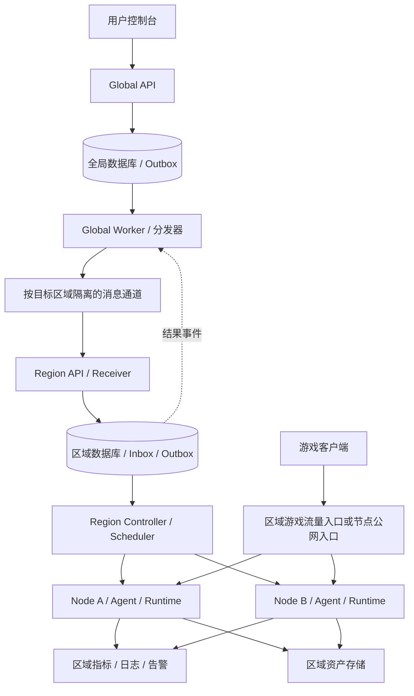

# Global / Region / Node 目标架构与交付契约

日期：2026-09-08。状态：用户已确认架构方向；本文是目标设计，尚非实现或生产验收报告。

本设计采用 [ADR-0001](../adr/0001-global-resources-regional-execution.md)，术语见 [领域语言](../../CONTEXT.md)。关于资源归属、调度粒度、停服和异步分发的早期方案，以本文为准。保持 Go、chi、Provider 与 Runtime Adapter，不按每个业务模块拆微服务。

## 当前实现与目标的区别

当前 app 同时启动 API、控制器、监控及游戏网关；单一 GameServer 模型混合配置、节点归属和观察状态。调度、OAuth、积分和端口预留仍有未提交批次；Region 主要是列表过滤，没有物理区域自治。Provider/共享 workload/worker、持久任务与执行租约可复用，但不代表基础设施 fencing、跨区恢复或商业闭环完成。进度证据见 [复核报告](../goals/SAAS_STATUS_REVIEW_2026-09-08.md)。

## 运行拓扑



资源部署层级仅为 Region → Node；Global 是管理职责，不是资源树中的父资源。每个 Region 独立管理数据库、消息队列、调度、监控和存储，不共享区域业务写库。本期不引入 Cell、cellId 或区域内二次分区调度。扩容先增加 Node 和区域服务副本；节点池只用于节点分类、授权和调度约束，不表示独立故障隔离单元。区域 MQ／数据库应在区域内具备适合目标可用性的高可用能力；不得依赖跨区域同步仲裁维持本地执行。图中分发器表示逻辑职责，不要求一个全局单进程。

建议组合入口：global-api、global-worker、region-api、region-controller、node-agent，游戏流量网关按需独立。逻辑模块先实现清晰接口，同一职责可有多副本；API 扩容不隐式启动另一套控制器。Node 注册后归属于唯一 Region，不接受跨区域任意控制器指令。创建云主机属于独立基础设施 Provider，首期允许人工加入节点池。

## 数据所有权

| 资源 | 权威写入方 | 其他层持有内容 |
| --- | --- | --- |
| 用户、组织、成员、会话 | 全局 identity / tenancy | Region 持有有期限、有版本的授权上下文，不复制用户密码 |
| 套餐、订单、支付、账本、权益 | 全局 billing | Region 持有带版本的执行权益与用量记录 |
| GameServer、ServerRevision、用户期望状态 | 全局 server | Region 保存不可变配置快照，不回写用户配置 |
| Placement、区域偏好、跨区迁移 Operation | 全局 placement | Region 持有本次部署归属和迁移执行阶段 |
| Deployment、节点、预留、任务、执行租约 | Region | 全局仅有归属索引与结果投影 |
| 实际容器、挂载、缓存、进程 | Node Runtime，Region 管理其生命周期 | Node 回报观察结果，不能自行变更订单或权益 |
| 原始日志、指标、告警 | Region 可观测系统 | 全局保存汇总、查询索引与观测时间 |
| Asset 逻辑身份、归属、版本及副本目录 | 全局资产目录 | Region 维护副本内容、上传会话与本地完整性状态 |
| 活跃世界存档 | 当前有效部署的唯一写入者 | 其他区域只能持有不可变快照，不能并行挂载写入 |

Region 在断连期间可以保存备份副本及待上报元数据，恢复连接后幂等登记到全局目录；未登记不等于文件可删除。全局不得直接写区域表，Region 不依赖查询全局库完成每次协调。当前大 domain/models.go 需要按所有者逐步拆分，不复制整套数据库模型作为协议。

## 实例、版本和部署身份

- `serverId`：全局稳定逻辑身份，归属于 organizationId；迁移不更换。
- `revisionId / specGeneration`：全局配置修订及单调版本；配置、规格、模组/快照引用必须固定版本。用户期望状态的变更也具有可比较版本。
- `placementEpoch`：全局部署归属版本；跨区域切换增加，与配置版本独立。
- `deploymentId`：区域部署身份，同一逻辑实例保留部署历史；通常只有一个有效部署。
- `assignmentUid / generation`：区域具体执行任务身份及版本，不与 specGeneration 或 placementEpoch 混用。
- `holderId / fence`：节点执行者身份及租约序号。fence 约束合作执行者，不等于强隔离。

每个结果必须关联 organizationId、serverId、deploymentId、placementEpoch 和已观察配置版本；消息 envelope 另含 eventId、operationId、schemaVersion、来源和目标区域。接收端核对权威归属、授权和版本，不能仅相信字段。旧部署结果可保留为历史，但不得更新新部署的当前状态。

配置用版本化期望状态快照同步，合并旧快照只适用于尚未执行且无副作用的配置意图。备份、恢复、迁移、重启等操作保留独立 Operation，不因到达较新配置而擅自丢弃。依赖前置步骤的命令须明确 prerequisite，不只比较一个数字。删除保留 tombstone，避免延迟创建消息复活资源。

用户配置中的秘密使用受控密文或凭证引用；MQ、全局状态投影和审计日志不包含明文密码或长期节点凭证。

## 创建时的调度契约

| 调用者 | 可选择 | 节点选择行为 |
| --- | --- | --- |
| 普通共享套餐用户 | 游戏、Region、套餐规格及游戏配置 | Region Scheduler 自动选 Node |
| 专属节点用户 | 上述内容及已授权节点池／专属 Node | 节点池内调度；指定 Node 时严格绑定 |
| 平台运维 | Region 和可选 Node | 仍校验权限、归属、健康、架构、容量、端口及禁止调度状态 |

全局 `SchedulingRequirement` 保存 regionId、可选 poolId/nodeId 及规格；区域 Allocation 保存实际 nodeId、端口、容量和预留状态。严格指定节点不能静默回退到其他节点；更改绑定通过新的授权操作完成。普通用户不获得共享宿主机列表。

Region 无容量时进入 WaitingForCapacity 或明确拒绝，不擅自跨 Region。默认节点架构等游戏需求由 Provider 声明；纯容量规则在候选选择和事务准入中共用。最终接纳必须在区域事务中重新验证并原子预留，快照打分不是占用凭证。规格中长期存储、网络与计算资源分别计算；停止请求不能提前释放。

## 可靠交付与事务契约

1. 全局本地事务写入操作、逻辑资源意图、适用的权益/配额预留和 Outbox；幂等键按租户及操作类型限定，重复键不同参数拒绝。返回 `202 + operationId`，不等待开服。
2. 分发器分批领取、限速投递到目标区域通道；发布确认后更新发送状态。确认丢失会重复发送，因此协议按至少一次交付设计。
3. Region 验证服务身份、消息 schema、区域归属、租户权益、部署版本；同一事务记录 Inbox 与部署意图/持久任务，提交后确认消费。不能先去重落库再独立创建任务。
4. Controller 有界并发领取持久任务，使用租约和版本条件更新；调用 Runtime 的外部副作用不置于数据库长事务内。执行不确定先观察，不能盲目重放破坏性操作。
5. Region 在状态变更事务内写结果 Outbox；全局幂等接收结果并更新操作投影、确认或补偿预留。需要扣费时使用独立业务幂等标识。

发布确认、Region 持久接收和运行成功是不同状态。MQ Ack 不代表业务交付完成。为同一实例建立可比较版本与必要顺序，不要求整个系统全局排序。

重试退避、有界并发、区域独立积压、死信告警和审计重放均为交付要求。低频分页对账检查过期投递租约、未完成操作及未回传结果；接收端去重记录、删除墓碑的保留期必须覆盖可接受的重放窗口。超过窗口进入显式恢复流程，不能当作新消息。

数据库与 Outbox 同事务避免提交后漏发；Inbox 与业务幂等避免重复消费造成重复效果。数据库和 MQ 的持久化、高可用、备份与恢复仍需验证，不承诺无条件零丢失或外部副作用 exactly-once。长连接本身不等于不稳定；消费者可持续连接，API 不等待长任务，日志/指标不挤占关键控制队列。

## 创建操作

`Accepted → AwaitingRegionalAcceptance → WaitingForCapacity / Provisioning → Ready`

全局预留与区域物理预留独立，关联同一个 operationId；临时容量不足可等待，明确不可交付可失败并补偿。等待期限由产品策略配置。投递超时、Agent 无回报只进入结果待确认，不直接退款、释放仍可能在用的容量或换区重建。

取消是带版本的独立操作；只有确认未启动、或已停止并清理，才能完成相应补偿。创建失败、释放配额、账务补偿均留记录并可重试。权益检查失败与区域容量不足分别报告。

## 停服与重新启动

`StopRequested → Stopping → Stopped → ComputeReleased`

- 全局保存用户停止意图；Region 执行停止，确认进程不再使用资源后释放 CPU/内存预留。停止中的资源仍计入占用，断连无法确认则保持待核实。
- CPU/内存的普通停服计费以可信停止证据截止，投影延迟不能自动延长收费；证据缺失进入对账。持久磁盘、备份、专用网络资源按版本化套餐继续计费。
- 默认保留存档、备份及逻辑访问端点；宿主机端口不承诺长期保留，释放必须确认实际绑定消失。专用 IP、端口预留等权益另行定义。
- 重启先重新申请容量，不保证原节点或立即成功。若换节点，必须具备可访问且一致的存档或完成源数据转移；没有安全副本时不能因为有空闲节点就启动新世界。
- 严格绑定 Node 的部署不能自动换节点。需要保证停服后容量的套餐采用显式容量预留权益，不隐藏在普通停服语义中。
- 欠费、区域维护、恢复保护记录为独立运行限制，不覆盖用户期望状态。充值只解除对应限制；仍需其他限制解除、意图希望运行、容量可用才能启动。

## 跨 Region 停服迁移

`Requested → TargetPrepared → SourceStoppedAndFenced → FinalSnapshotReady → TargetRestored → TargetHealthy → EndpointSwitched → SourceRetired → Completed`

目标准备仅预留资源和检查依赖，不启动第二个可写游戏进程。停止并隔离源部署后，生成可验证的最终快照，校验游戏/模组版本、摘要与资产归属；目标恢复与健康验证后切换入口。全局 Placement 协调每一步，Region 回报持久结果。

- 源隔离前目标失败：释放目标预留，源保持原运行。
- 源隔离后目标尚未可写：可等待重试；回滚需重新授权源部署及新的部署归属版本。
- 目标已产生写入：不能简单重启旧源快照；需要先隔离目标并同步最新数据，或明确接受恢复点损失的恢复操作。
- 源失联且缺少隔离证据：停在等待隔离状态，不自动恢复第二个写入者。版本号和租约过期不能证明旧游戏进程停止。
- 迁移期间可有两份物理预留，只占一个逻辑实例名额；临时容量、存储副本和费用政策单独记录，不重复售卖一个实例。

稳定逻辑域名不保证跨区域固定 IP/端口或旧连接不断开。入口切换由 Provider 支持的连接协议决定，处理 DNS 缓存与玩家重连。管理 API 网关不转发游戏数据流。

## 删除、授权与区域断连

删除通过全局 tombstone 和区域清理操作协调。实例删除、计算资源释放、资产保留期、账务及审计保留分别定义；删除请求不自动清空所有备份。全局无法确认区域清理时显示删除中，而不是丢弃追踪记录。

全局短暂不可用时，Region 继续既有运行、监控、备份和已接收任务。不能绕过全局接受新的用户配置、购买或跨区归属变更。区域可紧急停止并保存原因；不得因全局网络断连直接推断欠费并停机。

区域授权凭证必须有租户/动作/资源范围、版本、有效期与目标区域；Node 使用独立可轮换凭证。断连不延长用户凭证，新的特权操作不能依赖过期授权。已接受的持久任务按其授权快照、取消/撤权版本和操作风险执行；破坏性操作在有效授权不足时暂停。已知权益到期与单纯联系不上全局区分，宽限/停机规则由套餐快照定义。

区域资源详情可经授权路由访问 Region；全局列表使用异步投影，显示 observedAt 和过期状态。客户端 Region 选择只是偏好，实例访问按权威 serverId→Placement 路由，不能把任意 X-Region 当作授权或归属证据。

## 代码模块与实施顺序

- app / cmd 只做组合与生命周期；HTTP 做协议适配，通过应用用例处理业务。
- identity / tenancy / billing / global server / placement 拥有全局规则；regional deployment / scheduling 拥有区域执行规则。领域模块通过消费方小接口依赖持久化和消息 Adapter，不能相互写表。
- Provider 拥有游戏配置、文件与命令规则；共享 workload 只放执行协议和值类型，不包含整个账户、订单或全局数据库模型。Docker SDK 留在 Runtime Adapter。
- 事务锁、CAS、唯一约束和原子 Outbox 写入留在持久化 Adapter；业务策略不重复散落在 HTTP、Scheduler 和 Store。消息 schema 演进先定义兼容策略，未知版本隔离处理，不自动猜测。

实施门槛依次为：①拆清逻辑实例与部署模型及窄用例；②单区域跑通 Outbox/Inbox/操作状态与重复/乱序测试；③独立 Global/Region 进程与区域写库、授权及资产契约；④两区域断连、迁移、恢复验证；⑤商业与容量验收。不能整表搬迁 game_servers 代替领域拆分，也不恢复失联自动漂移作为迁移捷径。

数据库采用 PostgreSQL 作为托管 SaaS 目标；现有 SQLite 自托管兼容保留范围另行评估。MQ 产品、价格、计费周期、凭证有效期、任务等待期限、数据保留期和 RPO/RTO 尚待专项选型或测量；这些是参数与验收门槛，不改变已确认的所有权和调度规则。

## 验收矩阵

| 场景 | 必须证明 |
| --- | --- |
| 两租户互换实例/消息/资产 ID | 全局、区域与节点均拒绝越权 |
| Outbox 提交后进程崩溃 | 重启可继续投递；回滚事务不产生业务消息 |
| 消费提交前后崩溃、重复投递 | 不重复分配、扣费；任务可恢复 |
| 旧配置、旧 Placement、删除后的创建消息 | 不覆盖新状态、不复活资源 |
| 双区域同时报告同一逻辑实例 | 只有当前部署更新全局投影；历史结果保留 |
| 并发创建与扩容 | CPU/内存/主附加端口不超卖，失败不错误释放 |
| 严格指定 Node 不可用 | 等待或失败，不跨节点/跨 Region 回退 |
| 停服后在另一节点启动 | 容量重新预留，使用一致存档，旧写入者已停止 |
| 迁移任一步崩溃 | 操作可恢复、回滚遵循写入阶段、不双写 |
| 全局或一个 Region 断连 | 其他区域继续运行，授权不无限延期，积压隔离 |
| 取消与迟到成功交错 | 补偿不与有效运行并存，结果可对账 |
| 日志洪峰、慢消费者、MQ 不可用 | 有界资源使用，关键操作持久可恢复 |

上述均为未来实现验收项，不因图、接口或单元测试存在而视为完成。

## 一手参考

- [AWS Transactional Outbox](https://docs.aws.amazon.com/prescriptive-guidance/latest/cloud-design-patterns/transactional-outbox.html)：同事务记录事件、重复处理与跨服务补偿。
- [RabbitMQ Reliability](https://www.rabbitmq.com/docs/reliability)：发布确认、消费确认与故障重试责任。

## 区域 Deployment 初始落地边界（2026-09-09）

区域迁移 008 将 Deployment 从全局逻辑实例中独立出来。资产准备完成与待授权 Deployment 在同一事务提交；部署按 serverId＋placementEpoch 唯一，持有受保护配置快照的区域任务引用，不复制全局用户和账务数据。配置 generation 与用户意图版本分别检查，旧通知不回退现有期望配置，冲突通知不部分提交。

当前这张表仅落地待授权部署身份与期望配置，未分配 Node、容量或端口，也未生成执行授权。不同 Placement epoch 可保存不同部署记录；将来调度必须验证当前归属及旧部署隔离条件，不能因存在新记录就允许双实例运行。区域调度、实际任务派发与观察状态回传仍未完成。

## 区域节点配置入口（2026-09-09）

区域迁移 009 新增 regional_nodes，保存运维确认的节点身份、名称、运行架构、CPU／内存容量上限、调度开关和配置版本。Region 由数据库身份绑定，配置接口不提供跨 Region 修改字段。此表只描述管理配置，不表示节点在线、容量空闲或具备执行授权；后续调度必须同时读取有效心跳及事务预留。

运维使用有权限访问所属区域数据库的凭证，经 GAMEPANEL_REGIONAL_DATABASE_URL 注入；先迁移再配置：

```sh
go run ./apps/api/cmd/region-migrate -region east
go run ./apps/api/cmd/region-node -region east -id node-a -name node-a \
  -architecture amd64 -cpu 8 -memory-mb 16384
go run ./apps/api/cmd/region-node -region east -list -limit 50
```

新建使用 expected-version=0。更新为完整配置替换，必须提交列表返回的版本及全部配置字段；例如确认节点可参与调度后，提交对应容量、架构和 `-expected-version 1 -schedulable`。不传 schedulable 时为 false，可用于关闭调度候选资格；关闭开关不会停止或删除已有工作负载。并发或过期更新返回版本冲突，重新查询后由运维决定是否重试，不能盲目覆盖。

列表按节点 ID 排序，使用 `-after` 传入上一页末尾 ID，单页 1–200 条。此命令是区域运维入口，不向普通租户暴露宿主机清单。Agent 身份登记、心跳、节点池权限、容量预留及调度接线仍未完成；旧全局节点表和旧 Agent 路由尚未切换。

## 区域节点会话与心跳入口（2026-09-09）

region-control 提供 mTLS 节点控制入口。节点证书 URI SAN 通过区域运维白名单映射到 Node ID，Region 固定绑定区域数据库；请求 Header、查询参数或 JSON 都不能指定另一个节点身份。该入口复用现有证书链与有效期复核，白名单和 CA 轮换需要更新配置并重启／关闭受影响连接。

先通过 region-migrate 与 region-node 完成迁移、节点管理配置，再启动：

```sh
go run ./apps/api/cmd/region-control -region east -listen 127.0.0.1:8444 \
  -certificate /run/secrets/region.crt -key /run/secrets/region.key \
  -client-ca /run/secrets/node-ca.pem -node-identities /run/secrets/node-identities.json
```

数据库从 GAMEPANEL_REGIONAL_DATABASE_URL 注入。路径仅为部署示例；node-identities.json 示例为 `{"spiffe://gamepanel/east/nodes/node-a":"node-a"}`，必须使用实际签发的身份。

- `POST /internal/node/session`：无请求体。验证证书和已配置节点后签发递增 epoch，返回 `{"epoch":1}`；同时清空该节点旧观察的新鲜度与运行就绪标志。
- `POST /internal/node/heartbeat`：JSON 包含 sessionEpoch、递增 sequence、architecture 和 runtimeReady，成功返回 204。架构必须匹配运维配置，节点身份仍从证书得到。
- 区域迁移 010 的 regional_node_sessions 保存观察。旧 epoch、倒序 sequence、同序号冲突内容均拒绝；相同请求重试可成功确认，但不刷新 last_seen_ms。新观察使用区域数据库接收时间，不信任 Node 自报时间。

会话只约束心跳写入，不是运行租约或物理隔离证明。旋转会话不会停止旧容器，也不会改变运维设置的容量、版本和调度开关。实际 Agent 尚未切换到这个入口，节点在线窗口、容量预留、任务授权和调度仍待接入；不能用本批会话替代这些条件。

## Agent 区域观察模式（2026-09-09）

设置 AGENT_REGION_URL 后，Agent 使用区域节点证书建立会话并发送心跳；不启动旧 MASTER_URL／PANEL_URL 的注册、协调、隧道、日志或控制台任务循环。区域连接失败不会回退到全局地址。区域模式当前只报告 Docker 观察，尚未具备区域工作负载任务执行能力，不能直接视为现有节点迁移完成。

配置项：

- AGENT_REGION_URL：不含路径、账号、查询或 fragment 的 HTTPS Region 地址。
- AGENT_CLIENT_CERT、AGENT_CLIENT_KEY：该 Node 的客户端证书和私钥文件。
- AGENT_REGION_CA：验证 Region 服务端证书的 CA 文件。
- AGENT_HEARTBEAT_INTERVAL：默认 10s；AGENT_REGION_REQUEST_TIMEOUT：默认 5s，均须为正时长。
- DOCKER_HOST、AGENT_INSTANCE_ROOT：沿用现有 Runtime 配置。心跳测试仅查询 Docker，不创建或修改容器。

客户端使用 TLS 1.3、固定源地址、私有 CA 和客户端证书，不使用环境代理、不跟随重定向。会话响应有大小限制和严格结构检查。心跳序号按发送尝试递增，网络失败可留下序号间隔，但不会复用同序号发送不同内容；身份拒绝或会话被替换时退出，不自行重复登记争抢身份。

架构从实际 Docker daemon Info 获取并规范化，不以 Agent 所在宿主机架构代替。首次探测失败时不伪造就绪心跳；已获得架构后探测失败报告 runtimeReady=false。这里 runtimeReady 仅说明 Docker 观察可用，不证明区域任务执行能力、容量空闲或运行授权有效。

NodeSession／NodeHeartbeat 的线协议已放入共享 internal/workload，API 保留类型别名兼容；Agent 不导入 API internal。已用实际 Agent 二进制、Docker 只读 Info、mTLS Region 控制入口和本机 PostgreSQL 验证心跳落库，仍缺多主机、区域任务执行及真实游戏负载验收。

## 区域资源预留（2026-09-09）

区域迁移 011 新增 regional_allocations，绑定部署、租户、Placement epoch、配置及意图版本、节点配置版本和会话。ReserveRegionalResources 仅供受信区域协调器在确认归属与节点选择权限后使用；不是用户可直接调用的节点指定 API，也不签发执行授权。

首次预留按区域版本任务→Deployment→Node 的顺序加锁，核对已准备资产、当前期望运行状态、节点调度开关、配置版本、运行架构及会话。心跳新鲜度使用调用方给定的有界窗口和锁后数据库时间检查。按单个节点聚合仍占用容量的预留，复用 scheduling.CheckCapacity 进行 CPU／内存准入；全部预留写入者必须持有同一 Node 锁，避免并发超卖。

同部署的活动预留有唯一约束，完全相同请求返回原记录，改变节点或绑定版本会冲突。重放只是取回记录，不重签权限。节点离线、心跳过期或会话更换不会自动释放现有预留；释放须在后续生命周期流程取得停止／隔离证据后实现。

当前已具备有界候选与 CPU／内存／端口原子预留；节点范围授权来源、执行授权、区域任务派发和安全释放仍待接线。本批不向实际 Agent 下发工作负载，也不把 CPU／内存预留当成完整调度成功；现有待授权 Deployment 状态继续保留。

## 区域容量候选查询（2026-09-09）

RegionalCapacityCandidates 接收协调器已授权的一页 Node ID（1–200 个）、目标架构和资源需求。它不接受无限节点集合，也不从这些 ID 自行推导租户权限。RequiredNodeID 必须属于输入范围；指定后仅查询该节点，不可用时返回空候选，不回退到其他节点。

候选在只读 repeatable-read 事务中批量读取 Node 配置、对应会话观察、活动容量聚合，以及请求涉及的端口占用（有端口需求时），另读取数据库时间。查询无 JOIN，无逐节点 N+1；Go 使用 ID 映射组合结果，并共享区域预留的心跳规则和 scheduling.CheckCapacity。结果按 Node ID 稳定排序，包含节点配置版本、会话 epoch，以及接受本次资源需求后的剩余 CPU／内存。

候选仅是观察。调度协调器仍须通过 ReserveRegionalResources 在锁内复核；候选返回后节点被 cordon、会话变化或容量被占用，都不能依赖旧候选直接执行。当前查询覆盖 CPU／内存、端口和心跳，节点范围授权来源、跨页选择策略和执行任务仍未接线，不代表普通用户自动开服或完整指定节点能力已经验收。

## 区域完整端口预留（2026-09-09）

迁移 012 为 Allocation 保存规范化端口集合，并以独立 regional_port_reservations 记录实际 hostPort／protocol 占用，约束同节点活动端口唯一。ReserveRegionalResources 明确接收协调器为该配置版本渲染的完整 workload.Network，在原 CPU／内存事务内核验并保存所有绑定；不保留会忽略端口的旧方法入口。

主端口和附加端口复用 Runtime 的 ResolvePortBindings：缺省协议为 TCP，hostPort=0 取容器端口，完全相同绑定去重，冲突容器目标拒绝。区域单次绑定最多 128 个；hostPort=0 不表示自动寻找空闲端口。端口范围权限和动态端口选择策略仍由后续受信协调器接入。

候选通过一次有界附加查询检查请求涉及的端口，合计四组业务查询（无端口需求时三组），不查询区域全部端口。最终事务持有 Node 锁后重新检查，端口冲突或端口写入失败会连同计算资源整体回滚。TCP／UDP 独立、不同节点独立；幂等重放必须同时匹配完整端口集合与占用记录，不能修改已有网络或掩盖缺失绑定。

旧 Allocation 经迁移得到空端口集合，仅保留其原有计算资源含义，不代表其游戏端口已经补齐。网络计划必须来自受信渲染流程并在后续执行授权中绑定；本批未探测宿主机外部进程的实际端口占用，也不以数据库占用证明容器已启动。安全释放需在后续确认实际停止／绑定消失后同步释放计算与端口，不能因心跳过期直接释放。

### 配置版本与端口映射实现补充

区域端口计划由 `gameconfig.RegionalNetworkRenderer` 从受保护的不可变配置快照生成，复用现有 Provider。严格拒绝未知游戏版本和已知过期快照，不使用旧运行构建器的版本回退；调度和运行端口映射共用 `provider.RuntimeNetwork`。附加端口按主端口偏移计算，偏移到 0 或越界直接失败。网络结果不携带游戏密码或配置文件。

当前实现是供部署协调器调用的模块函数，尚未接入调度循环；快照解密不代表当前执行授权，端口选择仍须受授权范围约束并通过区域事务准入。没有增加部署层级或独立渲染服务。

### 区域调度协调实现补充

`regional.Scheduler` 复用网络渲染、候选查询和原子资源预留接口，单次处理至多 200 个受信授权节点，按候选稳定顺序尝试准入。严格指定节点不回退；竞争导致准入失败时返回错误，由持久调用方稍后重试。

在候选过滤之前按 Deployment ID 找回已有预留，并调用同一事务准入复核原回执。这样本次部署占满容量或节点离线后，丢失响应的重试仍可找回记录，不会重复预留其他节点。该回执不授予或延长执行权限。实际持久循环、权限来源及 Node 任务接线尚未完成。

### 持久调度任务实现补充

区域迁移 013 将调度领取、到期与退避状态保存在 Deployment 中。`SchedulingWorker` 领取后解析受信调度范围，调用现有 Scheduler，最后校验完整预留回执并提交 `scheduling_status=reserved`。这里的领取租约只限制任务状态提交，不授予 Node 运行权；到期不会释放容量或证明旧进程已停止。

配置／意图推进会清除旧领取并重新标记待调度；停服部署不会进入启动调度候选。旧资源释放仍须单独依据实际运行证据，不能由重置调度状态代替。当前已实现单次 Worker 和持久接口，生产范围解析及独立轮询入口仍待接线。

### 调度前全局复核实现补充

持久调度 Worker 在解析区域节点范围之前，复用全局 RevisionSource 读取当前意图。必须匹配当前配置代数、意图版本、运行期望、事件身份和不可变配置内容；全局断连或不同版本时持久退避，已有资源不因该失败自动释放。调用受单次任务超时约束，不建立长期监听。

这一步只证明读取时的全局意图及归属，不是权益、节点权限或有期限执行许可。后续仍需受信范围策略及 Node 执行授权；不能将一次复核视作全局与区域的原子事务。

### 区域租户节点策略实现补充

区域节点访问策略按全局 OrganizationID 保存显式节点集合、启用状态和 CAS 版本；未知或禁用租户默认拒绝新增准入。候选读取策略后与请求节点范围取交集，实际预留再持有策略 SHARE 锁复核。操作顺序为 Deployment → 节点策略 → Node；策略更新只锁自身，不反向锁 Node。业务 SQL 不含 JOIN，候选查询预算为无端口 4 次／有端口 5 次。

迁移 014 后，运维需要在每个区域通过 `region-node-access` 明确配置所需租户节点集合，例如 `go run ./apps/api/cmd/region-node-access -region <region-id> -organization <organization-id> -nodes <node-a>,<node-b> -enabled`；数据库连接通过 `GAMEPANEL_REGIONAL_DATABASE_URL` 提供。输出包含策略版本，后续完整替换需 `-expected-version`，省略 `-enabled` 表示禁用。节点可先配置授权后加入，未加入或离线节点不会成为候选。

该策略只管理区域节点访问，不是套餐权益、用户级指定节点权限或 Node 运行许可。原预留回执不因策略撤销被抹除，运行停止与容量释放继续要求独立证据。当前单条策略有界于 200 个节点，未验证大规模租户节点池管理。

### 自动端口方案选择实现补充

区域调度支持一个最多 64 个主机主端口的连续范围。Provider 输出只渲染一次，共享 workload 平移函数生成完整端口方案，保持容器端口、协议与附加端口偏移。候选查询将全部需要的主机端口合并成一次区域占用查询，Go 中按方案顺序选择，最终原子预留再次复核冲突。业务查询次数保持无端口 4／有端口 5 次。

已存在预留只在完整端口集合仍属于允许范围时恢复原回执，不重选端口。范围输入仍属于受信区域协调配置；本批没有宿主机端口探测或跨窗口遍历，也没有通过运行游戏证明端口可达。

### 区域调度入口实现补充

`region-scheduler` 已把持久调度、全局复核、Provider 渲染和数据库准入组合为可运行进程。租户节点集合来自区域运维策略，架构与有界端口窗口由区域部署配置提供；不以这些配置替代商业权益或 Node 执行权限。运行与验证边界见 [区域调度入口](regional-scheduler-running.md)。
