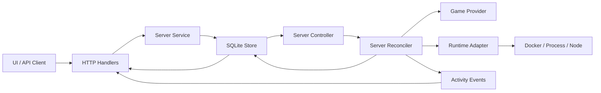
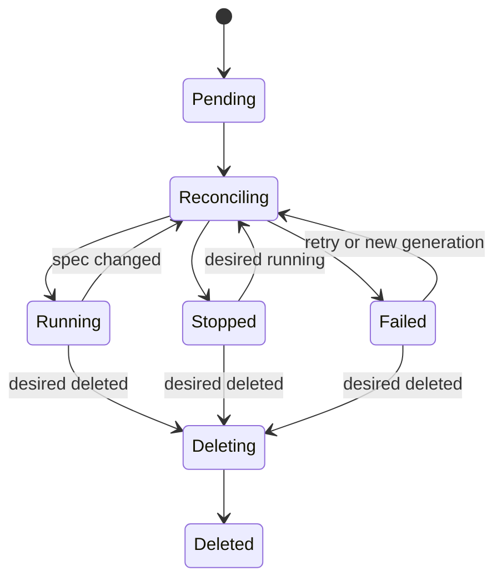

# Server Controller Refactor Plan

## Purpose

This plan describes a backend architecture refactor for GamePanel Lite server lifecycle management.

The target model is Kubernetes-style reconciliation:

- The API writes desired server configuration.
- A background controller observes desired state.
- The controller calls providers and runtime adapters asynchronously.
- The controller writes actual status, conditions, and activity events.

Compatibility with the current server lifecycle model is not required. The refactor may introduce breaking API and database changes if they make the architecture cleaner.

## Current Problem

The current backend already has asynchronous behavior in some places, but the ownership boundary is wrong:

- HTTP handlers update lifecycle status directly.
- HTTP handlers start goroutines for runtime operations.
- Runtime orchestration logic lives in `apps/api/internal/http/handler.go`.
- Read paths refresh and repair server status.
- Server data mixes desired config, actual runtime state, Terraria-specific config, and revision tracking in one flat model.
- Activity events are centered on rendered English messages instead of structured event data.

This makes lifecycle behavior difficult to reason about and makes future process/node runtimes harder to add.

## Target Architecture



The backend should be split into these responsibilities:

- `http`: decode requests, call services, encode responses.
- `server.Service`: accept user commands and update desired state.
- `server.Controller`: scan, queue, lock, and schedule reconciliation.
- `server.Reconciler`: run the state machine for one server.
- `provider`: validate and render game-specific configuration.
- `runtime`: manage workloads without knowing game details.
- `store`: persist server resources, status, and events.

## Desired Server Resource Model

Servers should be treated as resources with metadata, spec, and status.

```go
type GameServer struct {
	ID          string
	Name        string
	GameKey     domain.GameKey
	ProviderKey domain.ProviderKey

	Spec   ServerSpec
	Status ServerRuntimeStatus

	CreatedAt time.Time
	UpdatedAt time.Time
}
```

### Spec

`Spec` stores user intent.

```go
type ServerSpec struct {
	Generation   int
	DesiredState ServerDesiredState

	Version   string
	Config    map[string]any
	Resources ServerResources
	Network   ServerNetworkSpec
	Runtime   ServerRuntimeSpec
}
```

Suggested values:

```go
type ServerDesiredState string

const (
	DesiredRunning ServerDesiredState = "running"
	DesiredStopped ServerDesiredState = "stopped"
	DesiredDeleted ServerDesiredState = "deleted"
)
```

### Status

`Status` stores observed system state.

```go
type ServerRuntimeStatus struct {
	Phase              ServerPhase
	ActualState        ServerActualState
	RuntimeID          string
	ObservedGeneration int
	AppliedGeneration  int
	Conditions         []ServerCondition
	LastError          string
	LastReconcileAt    time.Time
	LastTransitionAt   time.Time
}
```

Suggested values:

```go
type ServerPhase string

const (
	PhasePending     ServerPhase = "pending"
	PhaseReconciling ServerPhase = "reconciling"
	PhaseRunning     ServerPhase = "running"
	PhaseStopped     ServerPhase = "stopped"
	PhaseFailed      ServerPhase = "failed"
	PhaseDeleting    ServerPhase = "deleting"
	PhaseDeleted     ServerPhase = "deleted"
)

type ServerActualState string

const (
	ActualRunning ServerActualState = "running"
	ActualStopped ServerActualState = "stopped"
	ActualMissing ServerActualState = "missing"
	ActualUnknown ServerActualState = "unknown"
)
```

### Conditions

Conditions should explain the state in a structured way.

```go
type ServerCondition struct {
	Type               string
	Status             string
	Reason             string
	Message            string
	ObservedGeneration int
	LastTransitionAt   time.Time
}
```

Example condition types:

- `RuntimeReady`
- `ConfigApplied`
- `WorkloadStarted`
- `WorkloadStopped`
- `DeleteComplete`

## API Behavior

HTTP endpoints must not call runtime adapters directly.

API actions only update `Spec`, bump `Spec.Generation`, and record command events.

Examples:

- Create server:
  - Validate request.
  - Normalize provider config.
  - Persist `Spec.DesiredState=stopped` or `running`.
  - Initialize `Status.Phase=pending`.
- Start server:
  - Set `Spec.DesiredState=running`.
  - Increment `Spec.Generation`.
  - Set `Status.Phase=pending` if needed.
- Stop server:
  - Set `Spec.DesiredState=stopped`.
  - Increment `Spec.Generation`.
- Restart server:
  - Keep `Spec.DesiredState=running`.
  - Increment `Spec.Generation`.
  - Add a restart intent if needed, or force runtime recreation by generation.
- Update config:
  - Update `Spec.Config`, `Spec.Resources`, `Spec.Network`, or `Spec.Runtime`.
  - Increment `Spec.Generation`.
- Delete server:
  - Set `Spec.DesiredState=deleted`.
  - Increment `Spec.Generation`.
  - Set `Status.Phase=deleting`.

## Controller Behavior

The controller runs as part of the API process at first. It can later move to a separate worker binary.

Responsibilities:

1. Periodically scan for servers needing reconciliation.
2. Lock per server ID to avoid concurrent reconciliation.
3. Load the latest server state.
4. Call `Reconciler.Reconcile(ctx, server)`.
5. Persist status changes.
6. Record structured activity events.
7. Retry failed but retryable states.

Servers need reconciliation when:

- `Status.ObservedGeneration < Spec.Generation`
- `Spec.DesiredState` does not match `Status.ActualState`
- `Status.Phase` is `pending`, `reconciling`, `deleting`, or retryable `failed`
- Runtime inspect reports drift

The first implementation can use a polling ticker. A later implementation can add an in-memory queue and database-backed work queue.

## Reconciler State Machine



Desired-state rules:

- `running` and no workload:
  - Render config.
  - Create workload.
  - Start workload.
  - Set phase `running`.
- `running` and workload exists but config generation changed:
  - Stop workload if needed.
  - Remove workload.
  - Render config.
  - Create workload.
  - Start workload.
  - Set phase `running`.
- `stopped` and workload running:
  - Stop workload.
  - Set phase `stopped`.
- `stopped` and workload missing:
  - Set phase `stopped`.
- `deleted`:
  - Stop workload if needed.
  - Remove workload if present.
  - Clean owned resources according to product rules.
  - Set phase `deleted` or delete the record.

Failures:

- Set phase `failed`.
- Keep the desired state unchanged.
- Store `LastError`.
- Write a condition with the failing reason.
- Record a structured activity event.

## Package Layout

The refactor should also split large files by feature.

```text
apps/api/internal/
  domain/
    server.go
    activity.go
    provider.go
    runtime.go
  server/
    service.go
    controller.go
    reconciler.go
    status.go
    spec.go
    events.go
    ports.go
    cleanup.go
    errors.go
    service_test.go
    reconciler_test.go
  provider/
    provider.go
    terraria/
      provider.go
      config.go
      config_render.go
      runtime.go
      presets.go
      seeds.go
  runtime/
    runtime.go
    docker/
      adapter.go
      create.go
      lifecycle.go
      inspect.go
      logs.go
      stats.go
      files.go
  http/
    handler.go
    servers.go
    games.go
    activity.go
    settings.go
    worlds.go
    backups.go
    mods.go
    presets.go
    response.go
    middleware.go
```

Splitting rules:

- Avoid adding more lifecycle code to `http/handler.go`.
- Keep files under roughly 500 lines when practical.
- `controller.go` should schedule work, not implement the full state machine.
- `reconciler.go` should reconcile one server, not handle HTTP or list queries.
- Provider packages should separate schema, config normalization, config rendering, runtime options, presets, and seed metadata.
- Runtime implementations should split create, lifecycle, inspect, logs, stats, and file helpers.

## Provider Interface Direction

Move shared server lifecycle code away from Terraria-specific config types.

Generic server specs should store provider config as a payload, but this does not mean every game must share the same common config fields. Each provider owns a strong typed config model internally and exposes behavior through interfaces. Shared packages must depend on provider interfaces, not on shared game config structs.

Current style to remove:

```go
ValidateConfig(domain.TerrariaConfig) error
RenderConfig(domain.TerrariaConfig) (string, error)
RuntimeOptions(domain.TerrariaConfig) runtime.ContainerOptions
```

Target style:

```go
type GameProvider interface {
	GameKey() domain.GameKey
	Key() domain.ProviderKey
	Name() string
	Description() string
	Capabilities() domain.ProviderCapabilities
	ConfigSchema() []domain.ProviderConfigField
	Versions() []string
	ImageFor(version string) string
}

type ConfigPayloadProvider interface {
	DefaultConfigPayload() map[string]any
	NormalizeConfigPayload(map[string]any) (map[string]any, error)
	ValidateConfigPayload(map[string]any) error
}

type ResourceRuntimeProvider interface {
	RuntimeConfigForResource(domain.GameServer) (domain.ProviderRuntimeConfig, error)
}

type JoinInfoProvider interface {
	JoinInfo(domain.GameServer) domain.ServerJoinInfo
}
```

Provider packages should keep their own high-cohesion config definitions:

```go
// provider/terraria/config.go
type Config struct {
	ServerName   string
	WorldName    string
	WorldSize    string
	Difficulty   string
	MaxPlayers   int
	Seed         string
	SpecialSeeds []string
	SecretSeeds  []string
}

// provider/minecraft/config.go
type Config struct {
	ServerName  string
	Difficulty  string
	GameMode    string
	MaxPlayers  int
	OnlineMode  bool
	EULAAccepted bool
}

// provider/dst/config.go
type Config struct {
	ClusterName string
	Token       string
	GameMode    string
	ShardMode   string
	EnableCaves bool
}
```

Provider-local helpers may parse and normalize payloads into strong types:

```go
func ParseConfig(raw map[string]any) (Config, error)
func NormalizeConfig(raw map[string]any) (map[string]any, error)
func RenderConfigFiles(config Config) (map[string]string, error)
func RuntimeOptions(config Config) (runtime.WorkloadOptions, error)
```

The server service and reconciler should only call provider methods:

```go
normalized, err := provider.NormalizeConfig(raw)
files, err := provider.RenderConfigFiles(server)
spec, err := provider.BuildRuntimeSpec(server)
```

Terraria-specific structs may still exist inside `provider/terraria`, Minecraft-specific structs inside `provider/minecraft`, and so on. They should not be embedded in the generic server domain model.

## Runtime Interface Direction

Move runtime terms toward generic workload management.

Target concepts:

```go
type WorkloadSpec struct {
	ServerID  string
	Name      string
	Image     string
	Network   WorkloadNetwork
	Resources WorkloadResources
	DataDir   string
	Files     map[string]string
	Options   WorkloadOptions
}

type Adapter interface {
	Check(ctx context.Context) RuntimeStatus
	PrepareImage(ctx context.Context, image string) error
	Create(ctx context.Context, spec WorkloadSpec) (runtimeID string, err error)
	Start(ctx context.Context, runtimeID string) error
	Stop(ctx context.Context, runtimeID string) error
	Remove(ctx context.Context, runtimeID string) error
	Inspect(ctx context.Context, runtimeID string) (WorkloadStatus, error)
	Logs(ctx context.Context, runtimeID string) (io.ReadCloser, error)
	SendCommand(ctx context.Context, runtimeID string, command string) error
}
```

Docker remains the first runtime implementation. Future implementations may manage local processes or remote node agents.

## Activity Event Direction

Replace message-first activity with structured event data.

```go
type ActivityEvent struct {
	ID         string
	ServerID   string
	Reason     string
	Severity   string
	MessageKey string
	Payload    map[string]any
	CreatedAt  time.Time
}
```

Examples:

- `server.create.requested`
- `server.start.requested`
- `server.reconcile.started`
- `server.runtime.created`
- `server.runtime.started`
- `server.config.applied`
- `server.reconcile.failed`
- `server.delete.completed`

The frontend should render localized messages from `MessageKey` and `Payload`.

## Implementation Phases

## Current Migration Status

Updated after the initial controller migration:

- Done:
  - `GameServer` resource model with `Spec` and `Status` exists in the domain layer.
  - Store CRUD supports `GameServer` resources directly and no longer auto-migrates or exposes old `GameServerInstance` CRUD APIs.
  - Server create/list/detail/start/stop/restart/delete HTTP endpoints return `GameServer`.
  - Start/stop/restart/delete update desired state and generation, then rely on the controller.
  - A polling controller and reconciler handle runtime create/start/stop/remove.
  - Deletion finalization removes owned worlds, backups, mods, shares, and instance data.
  - HTTP command/log paths now require an attached runtime instead of repairing or recreating runtime workloads.
  - OpenAPI documents the new `GameServer`, `ServerSpec`, `ServerRuntimeStatus`, and action responses.
  - Frontend API mapping now returns `GameServer` resources directly from `/api/servers`.
  - Command, log stream, log snapshot, and stats endpoints load the authoritative `GameServer` resource and call workload-native runtime I/O.
  - Player sync, monitoring, and Prometheus exporter read authoritative `GameServer` resources instead of legacy server rows.
  - Online player count now lives in `ServerRuntimeStatus.PlayersOnline`.
  - Join info, share pages, player list, player commands, whitelist commands, observability snapshots, and host-port allocation now start from `GameServer`.
  - The obsolete HTTP read-time status repair helper has been removed; runtime drift is controller-owned.
  - World import/snapshot/assign/delete, backup create/restore, server save snapshot/restore, and mod endpoints now load authoritative `GameServer` resources.
  - World template ownership is tracked in `ServerSpec.SourceWorldID` and `ServerSpec.SourceWorldName` so delete checks no longer scan legacy server rows.
  - Backup and save restore operations update desired spec/generation and set pending phase after restoring files; HTTP no longer removes runtime containers or saves legacy server rows during restore.
  - Provider workload construction now supports `ResourceRuntimeProvider`, so Terraria, Palworld, DST, and Minecraft build runtime config directly from `GameServer.Spec.Config` inside their provider packages.
  - The controller workload builder no longer creates a legacy server shim; providers must implement the resource runtime interface.
  - Runtime now exposes a workload-native adapter boundary (`CreateWorkload`, `StartWorkload`, `StopWorkload`, `RemoveWorkload`, `InspectWorkload`).
  - The controller-facing runtime client depends on the workload-native boundary and no longer maps lifecycle calls through `GameServerInstance`.
  - Docker implements workload-native lifecycle methods directly.
  - Runtime I/O now has workload-native methods (`StatsWorkload`, `LogsWorkload`, `LogSnapshotWorkload`, `SendCommandWorkload`).
  - The primary `runtime.Adapter` interface is now workload-native.
  - The temporary runtime `LegacyAdapter` bridge and Docker legacy wrapper methods have been removed; `apps/api/internal/runtime` no longer references `GameServerInstance`.
  - HTTP stats, logs, console commands, player sync, and observability snapshots call runtime I/O by `Status.RuntimeID` instead of passing a projected server instance.
  - Provider join-info generation now accepts `GameServer`, so join/share responses derive ports and passwords from `Spec` and provider-owned config parsing.
  - Player list, kick, ban, and whitelist HTTP endpoints load `GameServer` and use `Status.RuntimeID` instead of a projected server instance.
  - Server log streaming, log snapshots, and online-player updates now read/write `GameServer.Status` directly.
  - Backup and save snapshot list/create paths now read `GameServer.Spec.Runtime.DataDir` and `Spec.Config` directly.
  - World assignment, world snapshot creation, backup restore, save restore, and generic console command endpoints now use `GameServer` resource state directly.
  - Mod endpoints and runtime mod-file helpers now use `GameServer` resources directly.
  - HTTP production handlers no longer use the temporary `GameServerInstance` projection helper.
  - Provider workload construction now requires `ResourceRuntimeProvider`; the controller no longer creates a legacy server shim for runtime config construction.
  - The public `GameProvider` registry contract no longer exposes `domain.TerrariaConfig`, rendered config text, or container runtime options.
  - HTTP create, update, and config-preset paths now use provider-owned config payload interfaces for defaults, normalization, and validation.
  - Monitoring overview/load, Prometheus exporter metrics, observability snapshots, and server deletion cleanup no longer project `GameServer` back into `GameServerInstance`.
  - Production backend paths and HTTP/app tests no longer call legacy store server APIs such as `GetServer`, `CreateServer`, `SaveServer`, or `ListServers`.
  - Store no longer references `GameServerInstance`.
  - Palworld, Minecraft, and DST provider packages now use provider-owned typed `Config` structs internally instead of reusing `domain.TerrariaConfig`.
  - Palworld, Minecraft, and DST runtime file/env construction, payload normalization, and validation now operate on their own provider config models.
  - Frontend `/api/servers` mapping now treats server responses as `GameServer` resources at the API boundary without deriving a legacy view model.
  - Frontend typecheck, focused API mapper tests, and production build pass after the resource API boundary migration.
  - App-level backend tests now construct and decode `GameServer` resources directly.
  - Obsolete skipped HTTP tests for synchronous read-time runtime repair have been removed.
  - Production status label/reporting paths now use `ServerStatusFromRuntime` instead of legacy projection helpers.
  - HTTP tests now use local `GameServer` fixture helpers instead of importing the deleted legacy domain instance type.
  - `domain.GameServerInstance`, `NewGameServerFromLegacy`, and `LegacyInstanceFromGameServer` have been removed.
  - Backend `go test ./...` and `go vet ./...` pass after removing the legacy instance type.
  - Player list provider commands now accept `GameServer` resources instead of `domain.TerrariaConfig`; Terraria parses its own payload from `Spec.Config`.
  - Terraria language normalization now preserves explicit locale choices and only defaults to `en-US` when unset.
  - `ConfigPreset` no longer embeds `domain.TerrariaConfig`; presets persist and return provider-specific config payloads.
  - `World` snapshots no longer embed `domain.TerrariaConfig`; world metadata persists and returns provider-specific config payloads.
  - Terraria now owns its structured `Config`, `WorldSize`, `WorldEvil`, and `Difficulty` types inside `provider/terraria`; the domain package no longer defines Terraria-specific config types.
  - HTTP compatibility helpers and tests now use `terraria.Config` as an adapter type instead of a domain-owned game config.
  - Provider packages now expose `ConfigSummaryProvider`, allowing HTTP create/update/world paths to derive names, ports, player limits, passwords, and world names without converting every provider through Terraria config.
  - Palworld, Minecraft, DST, vanilla Terraria, and tModLoader each provide their own config summary from provider-owned structured config.
  - HTTP create/update, world assignment, world snapshots, and runtime world-path lookup now use provider-owned config summaries and normalized provider payloads.
  - Backend `go test ./...`, `go vet ./...`, frontend typecheck, lint, and production build pass after the provider summary split.
  - Frontend now exposes resource-native `listGameServers` and `getGameServer` APIs; legacy `listServers` and `getServer` wrappers have been removed.
  - Server list filtering and the `/servers` page now consume `GameServer` resources directly instead of converting the API result to the legacy `Server` view model first.
  - Dashboard server summary and active-server cards now consume `GameServer` resources directly.
  - App-shell global server search now queries `GameServer` resources directly.
  - World list/detail, backup list/detail, and mod detail server lookups now use `GameServer` resources directly.
  - Server detail now loads and renders `GameServer` resources through `getGameServer` without deriving a legacy detail view model.
  - Server detail header, stats enablement, overview info, activity error display, log lifecycle, and runtime resource card now read status/spec values from `GameServer` resources.
  - Server detail config form and resource limits dialog now derive drafts from `GameServer.Spec.Config`, `Spec.Network`, `Spec.Resources`, and `Status` instead of legacy flattened fields.
  - Server action buttons, join-info helpers, and console command helpers now accept `GameServer` resources directly.
  - `ServerCard` and `ServerActions` now accept `GameServerResource` directly.
  - Monitoring model helpers now accept `GameServerResource` lists directly.
  - Server metric helpers now expose `attachLatestBackupTimesToGameServers` for resource-native backup aggregation.
  - Focused frontend API/filter/metrics/monitoring tests, typecheck, lint, and production build pass after the latest frontend resource migration.
  - Server HTTP handlers continue moving out of `handler.go`; create/list/detail/actions/command/delete/stats/log stream/log snapshot now live in `server_handlers.go`.
  - Settings, server join-info, server share, and public share handlers now live in `settings_share_handlers.go`.
  - Game catalog and provider version handlers now live in `game_handlers.go`.
  - Config preset CRUD and preset-building logic now live in `config_preset_handlers.go`.
  - World list/import/download/assign/snapshot/delete handlers and world runtime-path helpers now live in `world_handlers.go`.
  - Backup and save snapshot list/create/download/restore/delete handlers, restore config sync, and backup record helpers now live in `backup_handlers.go`.
  - Runtime image prepare/status/archive install helpers and runtime support checks now live in `runtime_image_handlers.go`.
  - Mod upload, Workshop import, library assignment, global library endpoints, and recommended mod endpoints now live in `mod_handlers.go`.
  - Mod record upsert, metadata hydration, dependency resolution, runtime mod-file sync, visibility checks, and legacy Workshop install migration now live in `mod_helpers.go`.
  - Mod pack CRUD, payload validation, and response hydration now live in `mod_pack_handlers.go`.
  - Player list, kick, ban, and whitelist command handlers now live in `player_handlers.go`.
  - Health, runtime stats, metrics, activity list, runtime availability, and runtime error mapping handlers now live in `system_handlers.go`.
  - Cross-feature HTTP file helpers now live in `file_helpers.go`.
  - Provider config payload normalization, validation, summary helpers, preset hydration, and provider version helpers now live in `provider_config_helpers.go`.
  - Join-info, public host/locale resolution, and host-port allocation helpers now live in `join_info_helpers.go`.
  - Legacy Terraria preset/version/config-preview endpoints now live in `terraria_handlers.go`.
  - Docker runtime adapter has been split by responsibility: core adapter/workload lifecycle remains in `adapter.go`, image status/pull/archive logic lives in `image.go`, data mounts/files/port mapping live in `data.go`, stats live in `stats.go`, and logs/command I/O live in `io.go`.
  - Async controller integration tests now use a wider wait window for phase convergence, reducing full-suite timing flakes while preserving the expected failed-runtime assertions.
  - Backend `go test ./...` and `go vet ./...` pass after the latest HTTP handler split.
  - Activity events now support optional structured payloads persisted as `payload_json` and returned as `payload`; server command/share events, settings events, world events, backup/save events, mod events, and player command events write payload data.
  - The frontend activity renderer now prefers structured payloads for localized display across server, settings, world, backup/save, mod, and player event types, with rendered message parsing kept only as a historical fallback.
  - The controller now records structured reconciliation events after status persistence, including runtime workload creation/removal, server started/stopped/deleted, and reconciliation failures.
  - Frontend activity rendering now localizes controller/runtime event payloads such as `server.runtime.created`, `server.runtime.removed`, and `server.reconcile.failed`.
  - Frontend API now exposes resource-native write helpers (`createGameServer`, `updateGameServerConfig`, and `gameServerAction`); legacy write wrappers have been removed.
  - Server detail config save, resource limit save, and config restart paths now consume `GameServer` resource responses directly instead of round-tripping through the legacy `Server` view model.
  - Server action controls now use `gameServerAction` and cache `GameServer` resources directly; `ServerActions` and `ServerCard` props have been narrowed to `GameServerResource`.
  - The server detail mobile action controls and config tab no longer accept the legacy `Server` view model.
  - Create server flow now depends on `createGameServer` and returns `GameServerResource`; the wizard writes only the resource cache.
  - Server detail status helper types now depend on `ServerStatus` directly instead of importing the legacy `Server` view model.
  - Monitoring, server filtering, and backup aggregation helpers now accept `GameServerResource` only; legacy `Server` wrappers and tests for those helpers have been removed.
  - Join-info helpers, world compatibility helpers, and console command helpers now accept resource-shaped inputs instead of the legacy `Server` view model.
  - The frontend legacy `Server` view model, `legacyServerFromGameServer` adapter, old server API wrappers, and old `["server"]`/`["servers"]` cache writes have been removed.
  - Full verification passes after the frontend resource migration cleanup: backend `go test ./...`, backend `go vet ./...`, frontend typecheck, frontend unit tests, frontend lint, and frontend production build.
  - HTTP runtime image tests now live in `runtime_image_handlers_test.go`, matching the split runtime image handler module.
  - HTTP settings, public host, join-info, and share page tests now live in `settings_share_handlers_test.go`, matching the split settings/share handler module.
  - HTTP player management and whitelist tests now live in `player_handlers_test.go`, matching the split player handler module.
  - HTTP game catalog and provider version tests now live in `game_handlers_test.go`, matching the split game handler module.
  - HTTP Workshop mod import, recommended mod, legacy Workshop migration, mod upload/list/prune/idempotency, enabled-state mutation, running-server mutation, library assign/delete/global upload, and mod pack tests now live in `mod_handlers_test.go`, continuing the split of the large mod test group.
  - HTTP world import/list/download/delete/assign/snapshot tests now live in `world_handlers_test.go`, matching the split world handler module.
  - HTTP backup and save snapshot list/create/download/restore/delete tests now live in `backup_handlers_test.go`, matching the split backup handler module.
  - HTTP server lifecycle start/restart/stop/delete tests and provider-specific server create/runtime-spec tests now live in `server_handlers_test.go`, continuing the split of server handler coverage out of the legacy monolithic test file.
  - HTTP auth/CORS tests now live in `auth_handlers_test.go`; config preset tests live in `config_preset_handlers_test.go`; monitoring and observability metrics tests live in `system_handlers_test.go`.
  - Remaining server resource-limit, cleanup, log, unavailable-runtime, and legacy config-update tests now live in `server_handlers_test.go`; shared HTTP test fixtures/helpers now live in `test_helpers_test.go`.
  - Frontend create submission sends provider-specific config payloads directly through a generic `createGameServerWithResources` flow instead of requiring non-Terraria providers to pass through a Terraria-shaped config object.
  - Frontend review rendering now uses a provider-specific field model built from the selected provider schema; non-Terraria review no longer depends on Terraria `worldName`, `worldSize`, or `difficulty` display fields.
  - Config preset and world backfill now only update Terraria form state for Terraria resources; non-Terraria resources keep provider payloads in `providerConfigPayload`.
  - The old frontend `providerPayloadToTerrariaConfig` compatibility helper and tests have been removed.
  - Runtime host/workload stats exposed by the generic adapter and frontend API now use workload naming (`WorkloadStats`, `runningWorkloads`) instead of container naming, while Docker-specific adapter internals keep Docker container terminology.
  - Reconciler progress event scope is resolved for this refactor: controller-boundary structured events remain the source of lifecycle activity. Per-step reconciler internals should be added later only when the UI needs a detailed progress timeline.
- Deferred cleanup:
  - Some HTTP tests still use a flat local fixture shape for readability; this should be tightened into resource-native builders as the HTTP module is split.
  - `apps/api/internal/http/handler.go` now mostly contains handler construction, route registration, CORS, mutation lock helpers, activity recording, and JSON response helpers; mutation/activity/response helpers can be revisited later if they grow.

### Phase 1: Domain and Store Rewrite

- Introduce new server metadata/spec/status structs.
- Replace flat lifecycle fields with `Spec` and `Status`.
- Remove generic dependency on `domain.TerrariaConfig`.
- Update store CRUD and migrations.
- Add tests for default spec/status initialization and generation increments.

### Phase 2: Server Service and API Command Migration

- Add `apps/api/internal/server/service.go`.
- Move create/update/start/stop/restart/delete command handling out of HTTP.
- Ensure service only writes desired state and activity command events.
- Keep runtime calls out of service.
- Change `/api/servers` create/list/detail/action endpoints to use `GameServer`.
- Return server resources in metadata/spec/status shape.
- Keep resource modules behind a temporary projection only while their endpoints are migrated.

### Phase 3: Controller and Reconciler

- Add controller polling loop.
- Add per-server locking.
- Add reconciler state machine.
- Move runtime create/start/stop/remove logic out of HTTP.
- Move runtime spec construction into provider/reconciler boundaries.
- Add unit tests with runtime mock.

### Phase 4: Frontend API Migration

- Replace old flat `ApiServer` response type with `ApiGameServer`.
- Map UI status from `status.phase`:
  - `pending` and `reconciling` become `starting` or `stopping` based on `spec.desiredState`.
  - `running` becomes `running`.
  - `stopped` becomes `stopped`.
  - `failed` becomes `errored`.
  - `deleting` and `deleted` become `deleting`.
- Read version, config, resources, ports, and data directory from `spec`.
- Read runtime ID, error, observed generation, and applied generation from `status`.
- Compute pending restart from `status.phase == running && spec.generation > status.appliedGeneration`.
- Update create, config update, start, stop, restart, and delete calls to expect `GameServer`.
- Keep page-level UI components consuming the existing internal `Server` view model until the screen migration is complete.

### Phase 5: HTTP Layer Split

- Split server endpoints into `http/servers.go`.
- Keep `handler.go` focused on dependency wiring and route registration.
- Remove handler lifecycle goroutines.
- Remove read-time status repair from HTTP responses.

### Phase 6: Resource Endpoint Migration

- Move logs, stats, command, join-info, share, save, world, backup, mod, player, and whitelist endpoints to load `GameServer`.
- Replace temporary legacy projection with provider/runtime interfaces.
- Remove `GameServerInstance` once all resource endpoints and tests have moved.

### Phase 7: Provider Generalization

- Change provider interfaces to accept generic server/config payloads.
- Keep Terraria typed config parsing inside `provider/terraria`.
- Update Palworld, DST, and Minecraft providers to follow the same boundary.
- Update OpenAPI and frontend API types if needed.

### Phase 8: Runtime Generalization

- Rename container-centric runtime types to workload-centric types.
- Keep Docker adapter behavior intact behind the new names.
- Split Docker adapter files by responsibility.
- Prepare adapter boundaries for process/node implementations.

### Phase 9: Structured Activity

- Add structured activity fields.
- Migrate server lifecycle events to reason/message-key/payload.
- Update frontend i18n rendering.
- Remove regex-based message translation where possible.

### Phase 10: Verification and Cleanup

- Add controller integration tests.
- Add failure and retry tests.
- Run Go and frontend checks.
- Update OpenAPI contract and product docs.
- Remove obsolete lifecycle helpers and dead fields.

## Test Plan

Backend tests:

- Create server writes spec and status without runtime calls.
- Start request updates desired state and increments generation.
- Stop request updates desired state and increments generation.
- Config update increments generation.
- Controller reconciles stopped to running.
- Controller reconciles running to stopped.
- Controller recreates runtime when generation changes while desired state is running.
- Delete request reaches deleting and then deleted.
- Runtime failure sets phase `failed`, condition, last error, and activity event.
- Controller restart after process restart continues pending/deleting work.
- Reconcile is idempotent when called multiple times.

Frontend/API contract tests:

- Server list displays spec and status fields correctly.
- Server detail uses phase/actual state without layout shifts.
- Activity rendering uses localized message keys and payloads.
- Create/start/stop/delete flows handle pending/reconciling states.

Manual verification:

- Create a Terraria server.
- Start and observe phase progression.
- Stop and observe phase progression.
- Update config while stopped.
- Start and verify config is applied.
- Update config while running and verify runtime recreation.
- Delete and verify runtime cleanup.
- Restart API process during pending/deleting state and verify controller resumes.

## Acceptance Criteria

- HTTP handlers do not call `runtime.Adapter` directly for server lifecycle operations.
- Server lifecycle is driven by desired state and controller reconciliation.
- Server status is updated by the controller, not by read handlers.
- Provider-specific config does not leak into the generic server domain model.
- Runtime interfaces are workload-oriented and not Docker-only in domain naming.
- Activity events are structured enough for reliable localization.
- Large files are split by feature, especially HTTP handler and Docker runtime adapter files.
- Existing supported game flows still work after the breaking migration.
