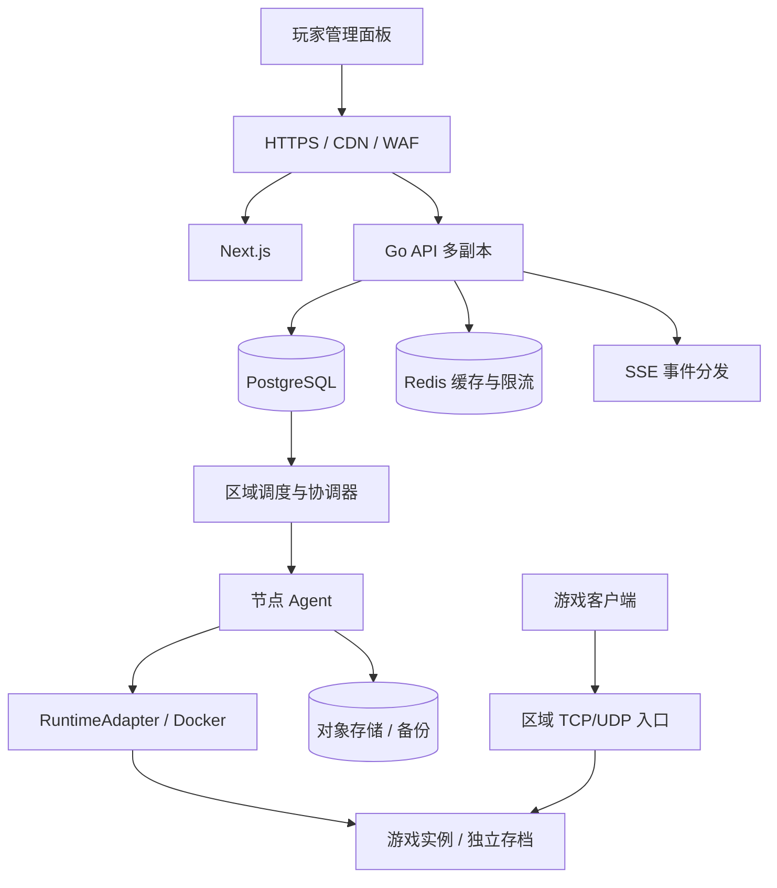

# GamePanel Lite ToC SaaS 实施方案

日期：2026-09-07。状态：方案草案，尚未实施或验证容量。

## 目标与假设

从自托管面板演进为面向个人玩家和好友小队的托管开服平台：注册 → 选游戏/区域/套餐 → 支付 → 自动开服 → 邀请好友 → 备份/续费。

按平台提供算力、单区域付费内测起步规划；首发地域、预算、团队人数、目标并发待业务确认。已有用户自带节点能力可以保留，但不作为首期商业闭环。采用固定套餐预付费，暂不增加钱包、复杂按秒计费和多云竞价调度。

用户此次 SaaS 目标明确扩大了原 V1 范围。本方案建议后续更新 AGENTS.md 中认证、多租户、计费及 SQLite 的约束；本次仅新增规划，不修改既有行为。

## 代码现状与差距

- `apps/api/internal/http/auth.go` 已有注册、登录、Cookie Session，全局账号仍为 AdminAccount 模型。
- `apps/api/internal/domain/models.go` 已有 Organization、OrganizationMember、TenantQuota；GameServer 已有 OrganizationID。复用现有组织作为租户，不再并列新增另一套 Tenant 实体。
- `apps/api/internal/http/handler.go` 的组织管理路由由全局管理员守卫保护；现有角色体系不能直接视为租户级授权。
- `apps/api/internal/store/store.go` 使用 SQLite、AutoMigrate 和进程内活动订阅；实例基础读取接口未强制要求组织参数。需要逐路由审计授权，不能仅凭模型字段判断隔离已完成。
- `apps/api/internal/server/controller.go` 默认每 3 秒遍历实例、按实例使用进程内互斥锁；多副本前需改为持久化领取与租约。
- `apps/agent/reconcile.go` 和 WorkloadAssignment/WorkloadObservation 已提供远程协调基础，应沿用 UID、generation 的一致性检查。
- `apps/api/internal/app/app.go` 同时启动 HTTP、控制器、监控和 StreamGateway；商业部署应拆开运行职责。

## 架构方向

后端模块职责、插件注册、依赖检查和硬编码治理遵循配套的 [后端模块化与插件扩展方案](backend-modularity-plan.md)。在租户与持久化改造前建立依赖基线，按小批次迁移现有游戏规则。

保留 Go、chi、Next.js、现有 Provider 与 RuntimeAdapter。先做模块化单体，API、控制器、Agent 和游戏网关可独立部署；不按每个业务名词拆微服务。

控制面负责身份、租户、订单、配额和期望状态；执行面负责调度、镜像和进程；游戏数据面负责游戏连接。游戏流量不得经过业务 API 或 Next.js。节点有公网地址时可直连，需稳定地址和攻击防护时用独立区域四层入口。TCP/UDP 按 Provider 的真实协议分别适配，不能把 HTTP CDN 当作游戏流量防护。

## 用户与租户隔离

1. User 是平台身份；Organization 是计费和资源归属单位；Membership 是组织内角色。个人注册时自动创建个人空间，产品上不要求普通玩家理解“租户”。邀请好友管理实例时才暴露成员功能。
2. 平台运营权限与组织 owner/admin/operator/viewer 分开。组织管理员不能管理计算节点、平台升级、其他组织或平台级设置。运营后台使用独立权限与审计，支持人员访问租户内容须有可追踪授权。
3. Session 识别用户；服务端验证所选组织的成员关系和动作权限。请求头、URL 的 organizationId 只能作为选择值，不能直接当授权结果。
4. 所有租户资源使用非空 organization_id，关联资源以组织一致的复合外键约束。覆盖实例、世界、备份、私有模组、预设、操作任务、分享和审计；平台公共素材另设显式公共范围。
5. Repository 的租户操作必须带已验证的组织范围。列表、详情、批量操作、文件下载、日志、SSE、搜索结果和统计都执行相同隔离；后台任务携带并验证归属，节点端不信任用户指定的主机路径。
6. PostgreSQL RLS 作为第二道防线：应用连接使用非 owner、无 BYPASSRLS 的角色，必要时 FORCE ROW LEVEL SECURITY。租户上下文通过事务内 SET LOCAL 设置，避免连接池复用串租户；跨租户控制器使用单独受限角色与路径。
7. 补齐邮箱验证、找回密码、会话撤销、登录防爆破、Cookie 安全属性、CSRF 防护。平台运营人员启用 MFA；需要第三方登录时采用成熟 OIDC 实现。

验收：两个组织互换任意资源 ID 都不能读取或修改；组织成员撤权后，现存 SSE、下载授权和异步任务按明确撤销规则失效；租户管理员访问平台接口被拒绝。

## 数据与异步一致性

- SaaS 主库迁移 PostgreSQL，保留 GORM，采用显式版本迁移。SQLite 仅在确定继续维护自托管发行版时保留，避免一开始承担两套数据库长期兼容成本。
- 迁移步骤：导出并备份 → 建表 → 为历史数据明确分配组织 → 校验数量/外键/文件清单 → 停写最终增量导入 → 切换 → 验证。恢复写入后回退必须处理新增数据，不能简单切回旧 SQLite。
- 请求事务内写 desired state、operation、outbox 与资源预留，返回 operationId。客户端轮询或 SSE 获取进度，禁止长请求等待开服/备份完成。
- 初期用 PostgreSQL 持久任务表、领取租约和 SKIP LOCKED 实现可靠队列；队列独立成为瓶颈后再选择一种消息系统。Redis 不作为订单、配额或实例状态的唯一事实来源。
- 控制器有界并发、按区域/节点分片，租约到期允许重新领取；任务执行幂等，使用唯一键、版本比较和 assignment UID/generation 拒绝过期写入。
- 热路径按变更入队，辅以分页、有速率限制的周期校验。领取租约不等于物理隔离：节点失联时不能直接判定旧实例已停机。
- 多 API 副本共享会话数据，活动事件持久化；SSE 通过共享分发层通知并按事件游标补拉。限每用户连接数、背压慢消费者、限制历史窗口，日志大量数据不逐行写业务主库。

## 调度、隔离与网络

- 节点模型补齐 region、zone、pool、CPU 架构、可分配 CPU/RAM/磁盘、端口池、健康、draining 和镜像缓存。
- 调度先过滤地域、架构、资源、端口、隔离等级，再做容量装箱；原子预留资源和端口，避免并发超卖。失败、取消、超时均有可重试的释放流程。
- 配额包含实例数量、CPU/RAM、存储、备份容量和并发操作数；不能用“先查询使用量再创建”的非原子方式检查。
- 实例有稳定逻辑 ID，部署有独立 assignment ID。节点身份使用可轮换凭证，逐步引入 mTLS；Agent 只接受本节点授权的固定操作。
- 设置 CPU、内存、PID、磁盘和网络约束；禁止 privileged、宿主 Docker socket、任意镜像、任意 host mount，过滤对宿主和云元数据地址的访问。
- 模组也是可执行的第三方代码。公有 SaaS 对用户上传代码应采用 VM/microVM 或经验证的沙箱隔离；普通容器共享宿主内核。首期可以限定经过审核的模组并使用独立风险节点池，但不能据此承诺强租户隔离。
- 游戏入口分区域扩容，管理面 WAF 与游戏 TCP/UDP DDoS 防护分开选型。端口分配键至少包含节点/入口地址、协议、端口；迁移后的端点更新和玩家重连要进入产品流程。
- 容量不足时排队或暂停售卖；基础设施扩容先人工维护节点池，之后基于预留量、排队时间、交付时间扩容，预热镜像并保留余量。缩容只排空可安全迁移的节点。

## 世界存档与故障恢复

活跃存档优先节点本地 SSD/块存储，对象存储保存校验后的备份与导出，不作为游戏进程的普通可写文件系统。

备份通过 Provider 保存/暂停或快照机制确保一致性，保存校验和、游戏版本、模组版本与备份完成状态。恢复操作必须可验证，不能只测上传成功。

迁移流程：源实例保存并停止 → 隔离旧实例写入 → 制作最终快照 → 目标校验并恢复 → 启动并健康检查 → 切换入口。源节点失联时，先确认电源/网络/存储层 fencing 生效，再恢复，防止双实例写入。无法隔离则等待人工处理。

控制面短暂故障时已有游戏继续运行。节点丢失后的恢复需要有可用容量和可恢复备份，并会损失最近备份之后的数据；不承诺透明热迁移或零丢失。

候选内测目标：控制 API 月可用性 99.9%；备份策略验证后争取 RPO ≤ 15 分钟、RTO ≤ 30 分钟。以上均为设计目标，需按游戏、存档大小、故障范围实测后决定套餐承诺。

## 商业闭环

- 套餐定义游戏/区域、CPU/RAM、存储、备份保留与期限；版本化保存价格和权益快照。
- 核心记录：Product/Plan、Order、Payment、Subscription、Entitlement、UsageRecord、ResourceReservation、Refund、AuditEvent。
- 支付回调验签、唯一事件去重并持久化；订单到账后授予权益，开服任务可重试。不得以支付成功页面跳转作为到账依据。
- 先确认容量预留及其有效期；支付成功但库存已失效时转入待交付/换区/退款流程，不能无期限挂起。
- 取消续费与立即停服分开；过期提醒 → 宽限期 → 停服 → 数据保留 → 按已告知规则清理。停服后存储仍产生成本。
- 建立支付渠道对账与开服失败补偿；记录节点、实例、时间段、计量版本以支持成本核算，首期无需复杂按秒账单。
- 支付渠道待首发市场确定后选择。付费上线前核查具体游戏的商业托管许可与分发条件。

## 容量设计与扩展路线

注册用户数不能替代容量指标。分别测：峰值管理 API RPS、SSE 连接、运行实例数、游戏在线人数、游戏带宽/PPS、日志量、开服峰值、备份读写吞吐。

示例假设，仅用于预算建模：10,000 个运行实例，每实例平均 4 GiB 内存、0.5 个实际 CPU 核、20 GB 存档。则约需 40,000 GiB 工作负载内存、5,000 核、200 TB 活跃存储；三份全量备份约 600 TB，未计压缩去重、镜像和日志。若每节点可分配 200 GiB 且目标只用 70%，仅内存就约需 286 个节点，实际还取决于 CPU、IOPS 和故障余量。

50,000 玩家、每玩家平均出口 50 Kbit/s 时约 2.5 Gbit/s；协议、游戏、模组和高峰可能显著改变结果。必须用实测分布和峰值系数校正，不能据此对外宣称容量。

阶段规模是验证顺序，不是现有能力保证：

| 阶段 | 验证规模 | 部署重点 |
| --- | --- | --- |
| 付费内测 | 100–300 运行实例 | 单区域、API 至少双副本、PostgreSQL HA、独立节点池、对象备份 |
| 增长期 | 1,000–3,000 运行实例 | 多节点池、分片协调、共享事件分发、交付队列、区域入口 |
| 规模期 | 10,000+ 运行实例 | 多区域 cell；每个 cell 有受限实例数及独立协调、入口与容量 |

Cell 是故障隔离单元：控制器、数据库热点或入口故障只影响有限实例。实例指定 home region/cell；全球目录保存位置，运行协调尽量区域自治。先做单写区域与异地灾备，再按明确需求设计跨区域账户与订单一致性；不一开始做全球多主数据库。

默认沿用 Docker Agent；有成熟 Kubernetes 运维能力时，可先将无状态控制面部署上 Kubernetes。游戏运行面是否迁移需比较有状态存档、升级排空、网络和运维成本。Agones 可作为后续评估对象，其分配能力不能替代租户、订单或存档恢复设计。

## 分阶段交付与验收

| 阶段 | 交付 | 必须通过的验收 |
| --- | --- | --- |
| P0 范围与基线 | 首发市场/套餐/游戏范围、资源归属审计、容量基线、更新 SaaS 开发约束 | 一个真实游戏套餐测得 CPU/RAM/带宽/启动/恢复与成本；确认所有租户数据入口 |
| P1 租户基础 | PostgreSQL 迁移、个人空间、组织角色、全链路授权、RLS、会话安全 | 数据迁移演练；跨租户读写/批量/文件/SSE 测试；普通租户不能调用平台接口 |
| P2 可靠交付 | API/控制器/网关分离、持久队列、节点池调度、资源预留、备份恢复 | 双控制器竞争不重复创建；并发不超卖；消息重复/进程重启可收敛；失联无双写 |
| P3 付费内测 | 固定套餐、支付/订单/权益、续费、暂停/保留、运营工具 | 注册到付款开服闭环；重复/乱序回调不重复授予；失败补偿及对账；恢复演练 |
| P4 扩容验证 | 负载压测、热点优化、区域 cell、容量预热、灾备 | 在明确硬件/负载条件下验证 1,000 再到 10,000 实例；区域故障不拖垮其他 cell |

P1、P2 可以在接口契约确定后并行安排，但付费上线必须通过两者的隔离与恢复验收。排期应在 P0 明确人员投入后评估，不把规模目标直接换算成几周承诺。

每阶段运行现有 Go 测试/vet、frontend lint/typecheck/build；新增授权集成测试、PostgreSQL 事务竞争测试、支付回调测试和 Playwright 核心旅程。压测单独覆盖 API、SSE、调度与真实游戏负载；用模拟 Agent 压测控制面不能证明游戏承载能力。

观测交付时间、任务积压、调度拒绝原因、节点资源、备份新鲜度、恢复成功率、支付与权益不一致数；建立告警和处理手册。指标避免无界租户/实例标签导致基数膨胀，实例细节放日志或查询系统。

## 下一步建议

先实施 P0/P1：把已有“组织管理脚手架”变成真正的个人空间与资源隔离，以两个独立用户完全互不可见、能各自管理服务器为第一条端到端验收线。随后推进双 API/双控制器的可靠交付。不要先投入大规模微服务拆分或跨云调度。

待确认的业务输入：国内还是海外首发；平台托管还是优先 BYOC；首期月基础设施预算；目标付费实例数与同时在线人数；团队投入；是否允许任意第三方模组。当前方案按平台托管、单区域、固定套餐、受控模组范围执行设计。

## 官方参考

- [PostgreSQL Row Security Policies](https://www.postgresql.org/docs/current/ddl-rowsecurity.html)：RLS 及 owner/BYPASSRLS 例外。
- [Kubernetes Multi-tenancy](https://kubernetes.io/docs/concepts/security/multi-tenancy/)：资源与隔离层次、共享内核风险。
- [Agones GameServerAllocation](https://agones.dev/site/docs/reference/gameserverallocation/)：实例原子分配能力。
- [Agones FAQ](https://agones.dev/site/docs/faq/)：多集群分散负载与故障风险。

本次为代码抽样审阅和架构规划，没有修改运行代码、执行容量压测或创建提交。
