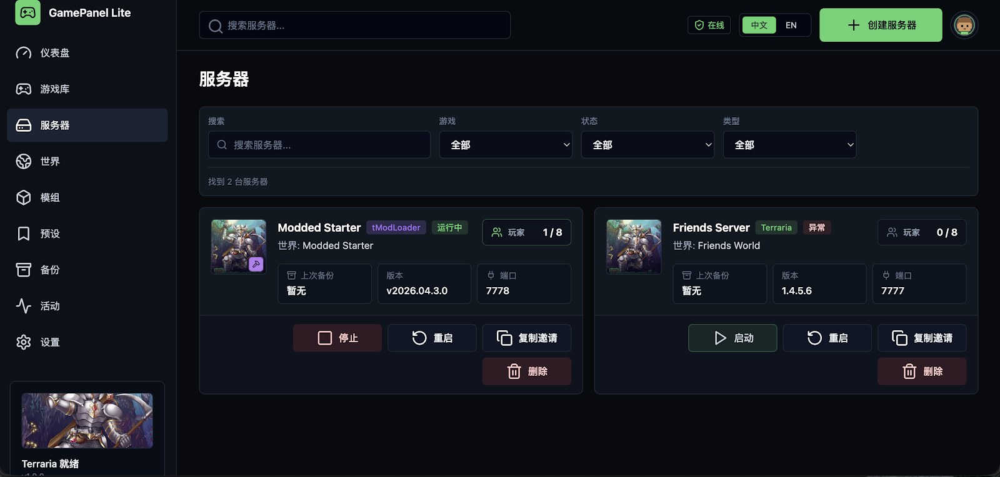
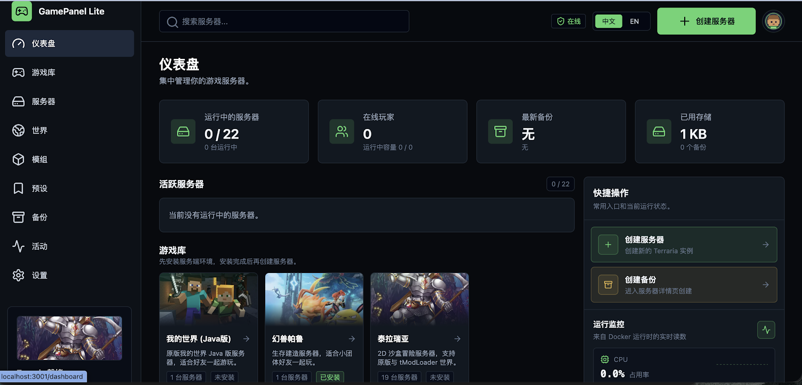

# 我做了一个开源游戏服务器面板：GamePanel Lite 现在支持四款游戏

## 公众号摘要

GamePanel Lite 是一款开源、自托管的游戏服务器管理面板，目前支持《泰拉瑞亚》《饥荒联机版》《幻兽帕鲁》和 Minecraft Java 版。

---

此前，我写过一篇使用 GamePanel Lite 搭建《幻兽帕鲁》专用服务器的教程。当时，它主要解决的是一款游戏的安装和日常管理。

现在，这个项目已经扩展为一套多游戏服务器管理面板：可以在浏览器中创建和管理《泰拉瑞亚》《饥荒联机版》《幻兽帕鲁》和 Minecraft Java 版服务器，也可以集中管理模组、存档、备份、日志以及多台计算节点。

> **先说结论：**
>
> - GamePanel Lite 是开源、自托管的游戏服务器面板，数据和游戏存档保存在自己的服务器上。
> - 当前支持四款游戏，覆盖创建、配置、异步启停、模组、备份、日志、资源监控和多用户协作等常用操作。
> - 它适合希望长期和朋友联机，但不想反复维护命令、配置文件与 Docker 容器的玩家。


## 01 从一次开服，变成可以长期维护的服务器

临时开一个游戏服务器并不算困难。网上通常能找到启动命令、Docker Compose 文件，或者已经整理好的专用服镜像。

真正麻烦的是开服之后。

游戏更新了，需要重新检查服务端版本；朋友想换地图，需要先确认存档位置；安装模组后启动失败，需要查日志和依赖；服务器迁移之前，还要确认配置、模组与世界文件有没有一起备份。

一台服务器还能靠命令和笔记维护。游戏和机器多起来以后，端口、容器、数据目录、模组版本和备份时间很快就会混在一起。

GamePanel Lite 做的事情，就是把这些分散的操作放进一个统一的 Web 面板里。玩家不需要记住每个容器的名称，也不用每次都通过 SSH 查找配置文件。

## 02 四款游戏，在同一个面板中管理

目前，GamePanel Lite 支持以下游戏和运行方式：

| 游戏 | 当前支持的主要能力 |
| --- | --- |
| 《泰拉瑞亚》 | 原版、tModLoader、Steam 创意工坊模组、`.tmod`、世界备份 |
| 《饥荒联机版》 | 地面与洞穴多分片、世界参数、Workshop 模组、集群备份 |
| 《幻兽帕鲁》 | 专用服务器、世界参数、版本更新、存档快照 |
| Minecraft Java 版 | 原版、Paper、Fabric、`server.properties`、世界备份 |

创建服务器时，可以直接选择游戏和运行模式，再填写名称、端口、密码、人数上限、世界规则以及 CPU、内存限制。创建完成后，服务器会作为独立容器运行，配置和存档也使用独立的数据目录。


这种方式有两个直接的好处：一是不同游戏之间不会共用配置和文件；二是删除、迁移或恢复某个实例时，更容易确认操作范围。

## 03 模组管理不再依赖手工抄写 ID

模组是游戏专用服最容易出问题的环节之一。

以 tModLoader 和《饥荒联机版》为例，服务端通常需要处理 Workshop ID、下载文件、启用状态、依赖关系，以及客户端是否需要安装同一模组。只要其中一项没有对应好，就可能出现服务端启动失败或玩家无法加入的情况。

GamePanel Lite 提供了统一的模组资源中心，可以检索和导入 Steam Workshop 内容，查看模组名称与类型，创建可复用的模组包，再安装到指定服务器。服务器详情页也会展示已经配置的模组，而不是只保留一串难以识别的 Workshop ID。


对于经常更换模组组合的玩家，这比反复编辑配置文件更容易检查，也更适合在重启服务器前确认变更内容。

## 04 日常维护集中在一个详情页

服务器创建完成后，常用操作都集中在详情页中：

- 启动、停止和重启服务器；
- 查看公网地址、端口和加入密码；
- 修改游戏规则与资源限制；
- 查看实时日志并发送支持的控制台命令；
- 查看在线玩家和运行状态；
- 创建世界快照、下载备份和恢复存档；
- 安装、停用或移除模组。



其中，我认为最重要的不是“能启动一个容器”，而是保留了服务器后续维护需要的上下文：这是哪款游戏、使用哪个端口、装了哪些模组、最近一次备份是什么时候、当前运行在哪台机器上。

这些信息能够被持续记录，服务器用得越久，价值越明显。

服务器启停、远程节点部署和部分更新操作会作为后台任务执行。点击操作后，页面会先返回任务状态，再持续更新实际运行结果。网络暂时变慢时，不需要让浏览器一直等待一个很长的请求；远程节点恢复连接后，也可以继续核对目标状态并完成任务。

## 05 多人共管时，每个账号只看到自己的权限范围

朋友服通常不会永远由一个人维护。有人负责调整游戏参数，有人只需要查看房间状态和加入信息，但他们不应该都拿到删除服务器、修改节点或更新面板的权限。

GamePanel Lite 现在提供三档本地账号角色：

| 角色 | 界面和操作范围 |
| --- | --- |
| 管理员 | 管理服务器、用户、计算节点、全局设置和面板更新，可以删除服务器 |
| 运维成员 | 创建、配置和启停服务器，管理模组、玩家、世界与备份，不能删除实例或修改系统 |
| 只读访客 | 只查看仪表盘、服务器大厅、运行状态与加入信息，不显示维护入口 |

权限限制同时在界面和服务端执行。界面会隐藏当前账号无权使用的入口；即使绕过页面直接请求接口，服务端仍然会再次校验角色。

这套设计面向一套自托管面板内的多人协作。目前项目不把尚未完成的跨租户资源隔离宣传为可用能力；如果需要让互不信任的团队完全隔离，仍建议分别部署面板实例。

## 06 备份和回档，应该成为开服的常规操作

游戏服务器最难补救的问题通常不是启动失败，而是存档损坏、误操作或更新后的兼容性问题。

GamePanel Lite 可以在面板中创建世界快照和完整备份，并提供下载与恢复入口。准备更新游戏、调整大型模组包或重建世界之前，可以先保留一个明确的恢复点。



备份仍然会占用服务器磁盘，也不能代替异地备份。重要存档建议定期下载到其他设备，或者再同步到独立存储中。面板解决的是备份操作和恢复入口的问题，不会改变底层磁盘本身的可靠性。

## 07 一处面板，也可以管理多台机器

当一台机器的资源不够，或者不同游戏部署在不同地区时，可以把其他 Linux 服务器接入为计算节点。

主面板负责记录每个服务器希望达到的状态，游戏实例实际运行在对应节点上。节点会持续对照目标状态完成创建、启停和重建，并把真实结果回报给面板。这样可以在同一个页面查看不同机器上的服务器，不必为每台机器分别部署一套完整面板，也不用来回切换多个管理地址。

对普通玩家来说，它带来的变化很直观：服务器放在哪里可以按资源和网络条件决定，日常管理仍然只保留一个入口。

## 08 哪些人适合使用 GamePanel Lite

这套面板更适合以下几类玩家：

- 有一台 Linux 云服务器、家用服务器或小型主机；
- 希望长期运行朋友服，而不是只临时联机一次；
- 同时管理多个游戏或多个世界；
- 需要模组、备份、日志和版本更新等日常维护能力；
- 希望数据留在自己的机器上，并愿意自己负责网络与服务器资源。

它不是云游戏服务，也不会自动提供公网 IP、云服务器或游戏授权。外网玩家要加入服务器，仍然需要正确配置公网地址、端口映射、云防火墙和系统防火墙。游戏本体及专用服务器的资源要求，也不会因为安装面板而降低。

## 09 一条命令安装面板

GamePanel Lite 当前要求 64 位 Linux（`amd64`）、Docker Engine 24 及以上版本和 Docker Compose v2。

环境准备完成后，可以执行：

```bash
curl -fsSL https://raw.githubusercontent.com/smartcat999/game-panel-lite/main/scripts/install-online.sh | sh
```

安装完成后，在浏览器中访问：

```text
http://服务器IP:3001
```

首次进入时创建本地管理员账号。没有全项目通用的默认密码，也不需要注册第三方平台账号。

管理面板不建议直接向整个公网开放。更稳妥的做法是限制来源 IP、通过 VPN 访问，或者配置域名与 HTTPS；游戏端口则按照服务器详情页显示的协议和端口单独放行。

## 10 项目仍在持续完善

GamePanel Lite 是我正在持续开发的开源项目，不是任何游戏厂商的官方管理工具。不同游戏对控制台、玩家列表、模组和更新机制的支持程度并不完全相同，具体功能会按照游戏本身的能力分别提供。

如果你正在自己维护游戏专用服，可以先通过在线演示了解界面，再决定是否部署到自己的服务器。

- 在线演示：<https://dev.gamepanel.site>
- GitHub：<https://github.com/smartcat999/game-panel-lite>
- 图文使用指南：<https://github.com/smartcat999/game-panel-lite/blob/main/docs/USER_GUIDE.zh-CN.md>
- 问题反馈：<https://github.com/smartcat999/game-panel-lite/issues>

如果这个项目对你有帮助，欢迎在 GitHub 点一个 Star，也欢迎把实际开服过程中遇到的问题提交到 Issues。真实的使用反馈，会直接影响后续功能的优先级。

---

## 排版备注（发布时删除）

1. 推荐封面标题：**我做了一个开源游戏服务器面板**。
2. 推荐封面副标题：**四款游戏，一个面板统一管理**。
3. 首图使用 `gamepanel-demo-zh-CN-poster.png`，正文第一张使用中文演示 GIF。
4. 图片顺序用于证明：支持的操作范围 → 创建服务器 → 模组管理 → 日志控制台 → 角色权限 → 备份恢复。正式发布前补一张“设置 → 团队”中的三档权限截图。
5. 微信后台若无法直接导入本地 GIF，请上传 `apps/web/public/official/gamepanel-demo-zh-CN.gif`；原始高清版本为同目录下的 `.mp4`。
6. 备选标题：
   - 从《幻兽帕鲁》到四款游戏：GamePanel Lite 更新了什么
   - 开源、自托管、多游戏：我做的游戏服务器面板现在可以用了
   - 不想再用命令维护朋友服，我做了 GamePanel Lite
