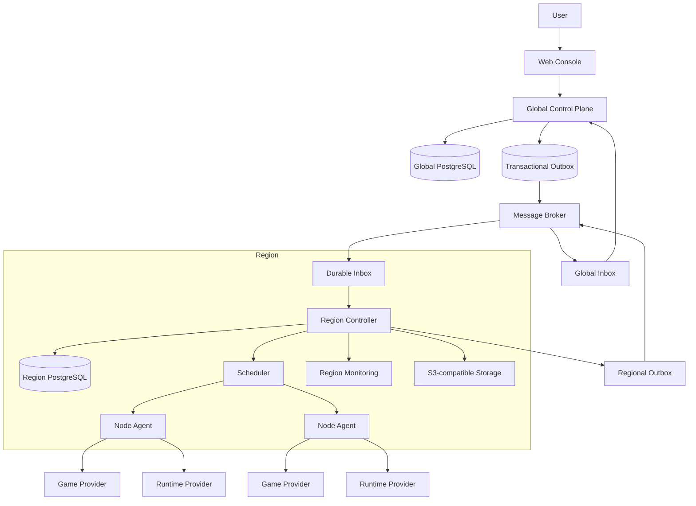

# Target Architecture

## System shape

There is no Cell layer. A Region contains multiple Nodes and is the unit of independent deployment, failure isolation, operations, monitoring, storage policy, and data ownership for execution.

## Ownership by resource level

| Level | Owns | Must not own |
| --- | --- | --- |
| Global Control Plane | Users, identities, sessions, Role Bindings, Workspaces, Price Books, Quotes, Wallets, Ledger Entries, Usage Records, Logical Instances, Instance Revisions, Placements, Region Directory, customer-facing summaries | Nodes, runtime processes, regional reservations, live metrics |
| Region | Regional Deployments, Nodes, Reservations, Regional Tasks, task attempts, observations, monitoring, storage endpoints, backup execution | Users, Role Bindings, Wallets, canonical instance configuration |
| Node | Work Assignments, local workload state, runtime handles, local files, execution observations | customer identity, billing state, global scheduling |

Every durable row includes its own aggregate ID and scope ID. Database access uses primary-key or indexed foreign-key queries followed by bounded batch reads and code composition. SQL JOIN is forbidden in request paths, workers, schedulers, and reporting queries. Purpose-built denormalized read models are allowed when maintained asynchronously.

## Process boundaries

### Control Plane

One stateless Go binary exposes customer and platform APIs. Authentication, typed resource resolution, and bounded batch authorization run in route filters before handlers. Modules own their own tables and only expose interfaces. A command writes its desired state, durable Operation, and outbox record in one short database transaction, returns `202`, and leaves external I/O to workers.

### Region Controller

One independently deployed Go binary per Region consumes global events into a durable inbox, schedules Regional Deployments, owns regional reconciliation, and publishes sequenced status summaries. It continues operating existing workloads during a temporary global outage.

### Node Agent

One Go process per Node claims durable assignments from its Region with bounded polling and backoff. It never maintains a required long-lived connection to the global plane. It reconciles locally through Game Provider and Runtime Provider adapters and reports idempotent observations to the Region.

## Core flows

### Create and deliver an instance

1. The User enters a Workspace and chooses a Region, game version, provider-driven configuration, and a custom resource specification within the Region catalog. Node and public port are absent from the customer contract.
2. The Control Plane validates the 10-minute Quote, Capacity Hold, Workspace Role Binding, and Funding Authorization, then creates the Logical Instance, first Instance Revision, Placement, Operation, and outbox record in one short transaction.
3. An outbox dispatcher publishes `deployment.desired.v1` through NATS JetStream. Broker delivery never becomes business authority.
4. The target Region records the message in its durable inbox before acknowledgement and creates or updates the Regional Deployment.
5. The Region allocates compatible Endpoint Bindings, reserves capacity, and schedules a Node.
6. The Node claims a fenced Work Assignment and reconciles the workload through provider adapters with public internet access but no platform-management-network access.
7. Node observations are sequenced through the Region; the Control Plane updates a denormalized Deployment Summary and starts metering only confirmed allocated resources.
8. Reconcilers repair expired leases, stuck Operations, missed delivery, and residual resources from durable state.

### Backup

1. The Control Plane owns the Backup Request and its customer-visible lifecycle.
2. The Region executes the request as a durable Regional Task.
3. The Node streams archive data directly to Region-configured S3-compatible storage by a scoped upload contract.
4. The Region reports completion and object metadata to the Control Plane asynchronously.

World import and World management are outside V1. Cross-Region migration is outside the initial product path. Instance-level restore within the owning Region is the first supported recovery flow.

## Observability identity

Logs, metrics, retention, and customer queries use Logical Instance ID as their stable identity. Regional Deployment, Work Assignment, Runtime Attempt, and runtime handle are denormalized provenance dimensions. Runtime replacement or deletion never deletes centralized history; stale fencing generations cannot become the current observation.

## Required invariants

- A customer chooses a Region; only the regional scheduler chooses a Node.
- Node selection may exist only in a separate operator workflow with explicit Region-scoped authority and no automatic fallback.
- One Logical Instance belongs to one Workspace and has one active Placement version.
- A Region accepts a placement only when its version is newer than the recorded version.
- A Node accepts an assignment only with the current fencing token.
- Wallet balance is derived only from immutable Ledger Entries; UI state and browser callbacks never grant funding authority.
- Message delivery is at least once; inbox handlers and state transitions are idempotent.
- Large binaries travel directly between Node and object storage or registries, never through the Control Plane.

## Provider migration seam

Legacy Game Provider and Runtime Provider implementations are copied only after the new platform interfaces have contract tests. Migration proceeds adapter by adapter; new code cannot import `apps/api/internal/...`. The first migration report must list behavior preserved, behavior rejected, and security checks retained.
