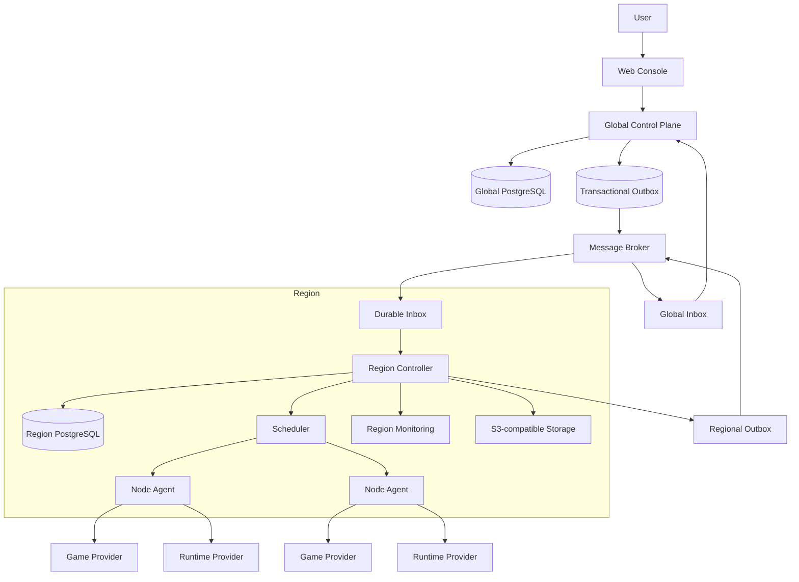

# Target Architecture

## System shape

There is no Cell layer. A Region contains multiple Nodes and is the unit of independent deployment, failure isolation, operations, monitoring, storage policy, and data ownership for execution.

## Ownership by resource level

| Level | Owns | Must not own |
| --- | --- | --- |
| Global Control Plane | Users, User Preferences, Workspaces, Memberships, Plans, Orders, Payments, Entitlements, Logical Instances, Instance Revisions, Placements, Region Directory, customer-facing summaries | Nodes, runtime processes, regional reservations, live metrics |
| Region | Regional Deployments, Nodes, Reservations, Regional Tasks, task attempts, observations, monitoring, storage endpoints, backup execution | Users, Workspace roles, orders, canonical instance configuration |
| Node | Work Assignments, local workload state, runtime handles, local files, execution observations | customer identity, billing state, global scheduling |

Every durable row includes its own aggregate ID and scope ID. Database access uses primary-key or indexed foreign-key queries followed by bounded batch reads and code composition. SQL JOIN is forbidden in request paths, workers, schedulers, and reporting queries. Purpose-built denormalized read models are allowed when maintained asynchronously.

## Process boundaries

### Control Plane

One stateless Go binary exposes customer and platform APIs. Modules own their own tables and only expose interfaces. A command that changes an aggregate writes its outbox record in the same database transaction.

### Region Controller

One independently deployed Go binary per Region consumes global events into a durable inbox, schedules Regional Deployments, owns regional reconciliation, and publishes sequenced status summaries. It continues operating existing workloads during a temporary global outage.

### Node Agent

One Go process per Node claims durable assignments from its Region with bounded polling and backoff. It never maintains a required long-lived connection to the global plane. It reconciles locally through Game Provider and Runtime Provider adapters and reports idempotent observations to the Region.

## Core flows

### Create and deliver an instance

1. The User enters a Workspace and chooses a Plan, Region, game version, and configuration. Node is absent from the customer contract.
2. The Control Plane validates Membership and the immutable Plan version, then creates a Logical Instance, Instance Revision, Placement, and pending Order under one transaction when purchase is required.
3. A verified payment settles the Order and creates or extends the Entitlement. Browser redirects never grant authority.
4. The Control Plane writes `deployment.desired.v1` to its transactional outbox only when an active Entitlement authorizes execution.
5. The target Region records the message in its inbox before acknowledgement, creates or updates the Regional Deployment, and schedules a Node.
6. The Node claims a fenced Work Assignment and reconciles the workload through provider adapters.
7. Node observations are sequenced through the Region; the Control Plane updates a denormalized Deployment Summary for the Workspace Console.

### Backup

1. The Control Plane owns the Backup Request and its customer-visible lifecycle.
2. The Region executes the request as a durable Regional Task.
3. The Node streams archive data directly to Region-configured S3-compatible storage by a scoped upload contract.
4. The Region reports completion and object metadata to the Control Plane asynchronously.

Cross-Region migration is outside the initial product path. Restore within the owning Region is the first supported recovery flow.

## Required invariants

- A customer chooses a Region; only the regional scheduler chooses a Node.
- Node selection may exist only in a separate operator workflow with explicit Region-scoped authority and no automatic fallback.
- One Logical Instance belongs to one Workspace and has one active Placement version.
- A Region accepts a placement only when its version is newer than the recorded version.
- A Node accepts an assignment only with the current fencing token.
- Payment verification and execution authority are separate from UI state.
- Message delivery is at least once; inbox handlers and state transitions are idempotent.
- Large binaries travel directly between Node and object storage or registries, never through the Control Plane.

## Provider migration seam

Legacy Game Provider and Runtime Provider implementations are copied only after the new platform interfaces have contract tests. Migration proceeds adapter by adapter; new code cannot import `apps/api/internal/...`. The first migration report must list behavior preserved, behavior rejected, and security checks retained.
